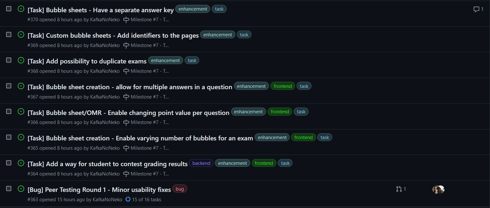

# Peer Testing Round 1

## Tasks

We asked participants to perform the following 5 tasks.

1. Feature 1 (student)

* Sign in to the system
* Navigate to one of your courses
* Find out what your grade is for one of the exams

2. Feature 2 (instructor)

* Sign in to the system
* Create a course
* Find the newly created course in the courses table

3. Feature 3 (instructor)

* Sign in to the system
* Create an exam
* Fill out a bubble sheet with the correct answers
* Download the bubble sheets you made

4. Feature 4 (instructor)

* Sign in to the system
* Navigate to one of your exams
* Upload the submission files

5. Feature 5 (admin)

* Sign in to the system
* Create a new semester
* View the changes in the semesters table

## Recorded bugs/Action items

The raw results can be found under the `/raw-results` folder. Based on the feedback, we identified a few minor usability adjustments to be made. These were recorded as [issues](https://github.com/UBCO-COSC499-Summer-2024/team-7-capstone-team-7-falcon/issues/363) in our repository and have mostly been addressed already.

## Analysis

The questionnaire was administered through Qualtrics, and results were downloaded as a CSV file with numeric values. The total number of responses received is $n=11$. Since not all likert-scale/numeric questions were answered, blank(NaN) questions were given a value of $0$.

The first section of the survey focused on the tasks users were asked to perform. Questions from the [NASA Task Load Index](https://humansystems.arc.nasa.gov/groups/tlx/downloads/TLXScale.pdf), rated on a 7-point Likert scale, were utilized to evaluate four factors associated with each task: mental demand, performance, effort, and frustration. The responses for mental demand, effort, and frustration were reverse-coded for analysis and scaled to the range 0-100 (see the jupyter notebook). The following table summarises the results for each task.

|        | Mean TLX Score |
|--------|----------------|
| Task 1 | 69.7           |
| Task 2 | 71.2           |
| Task 3 | 70.5           |
| Task 4 | 68.2           |
| Task 5 | 73.5           |

The average raw TLX score for all tasks is $70.6$.

The second section made use of the standard Website Usability Scale (WUS) which is based on the System Usability Scale (SUS). Analysis was conducted according to the standard scale for SUS and the mean WUS score for our system is $64.8$. We also asked respondents to rate, on a scale of 1 to 10 (with 0 being a possibility if no response is provided), how likely they were to recommend the website to others. The mean score for all participants (including those who did not respond) is $5.82$, but the score jumps to $7.11$ if we only consider non-zero responses.

Finally, the survey contained two free-text questions asking participants to identify elements they like about our system as well as those they would change. Overall, respondents appreciated the 'intuitive' and 'simple' UI design and the 'efficiency' of the system. Areas for improvement included providing more visual feedback to users after actions are performed and making some actions such as creating and grading exams more intuitive.

## Discussion

Overall, the results show that our website has relatively good usability with both the TLX scores and WUS scores being in the acceptable ranges. ([One study](https://measuringu.com/sus/) has found that the average SUS score is 68.) One important limitation to keep in mind is the low number of participants ($n=11$). In addition, since blank responses were replaced with a score of 0, these have also affected the calculation of the mean for the TLX scores. Finally, while there has been some contradicting feedback in terms of the intuitiveness of the website, the overall sentiment seems positive (especially when factoring in the verbal feedback the team received) and the recommendation is to provide more visual feedback to users after actions are performed and maybe some guides or tool-tips as well.
