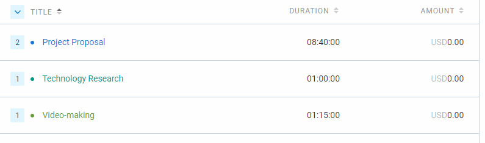

# May 29 - May 31

## Tasks worked on

Alternatively, use a screenshot of your clockify page (easier).

## Completed since last reporting date

- Recorded and edited the project proposal video
- Finished and submitted propect proposal

## In Progress

Design document:

- Use case models (with everyone).
- Data flow diagram with Paula and Ishika.

## This week's goals

This week:
1. Work on design document
2. Create use case models
3. Submit the project proposal document and video

Next cycle:
1. Finish DFD
2. Meet with client to finalize requirements
3. Setup CI/CD pipeline
4. Convert requirements to issues on the project board

