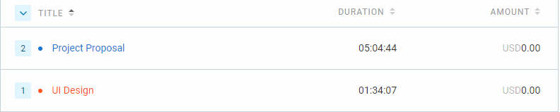

# May 29 - May 31

## Tasks worked on

Alternatively, use a screenshot of your clockify page (easier).

## Completed since last reporting date

- Finished DFD lv 1
- Revised and finished use case diagram
- Looked over design document with team
- Discussed improvements to UI design

## In Progress

- Recording and editing design video
- Doing review for other team's requirements videos

## This week's goals

This week:
- Finish the design document and all related diagrams

Next cycle:
1. Recording and editing design video
2. Doing review for other team's requirements videos
3. Setup CI/CD pipeline
4. Convert requirements to issues on the project board

