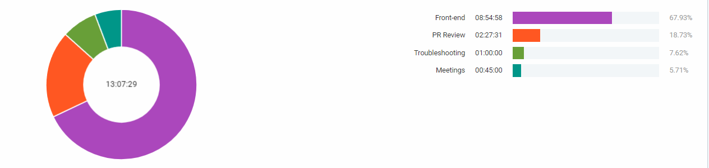
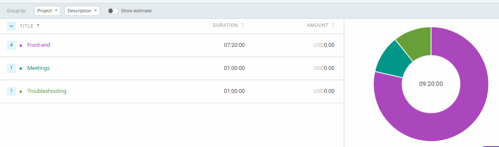
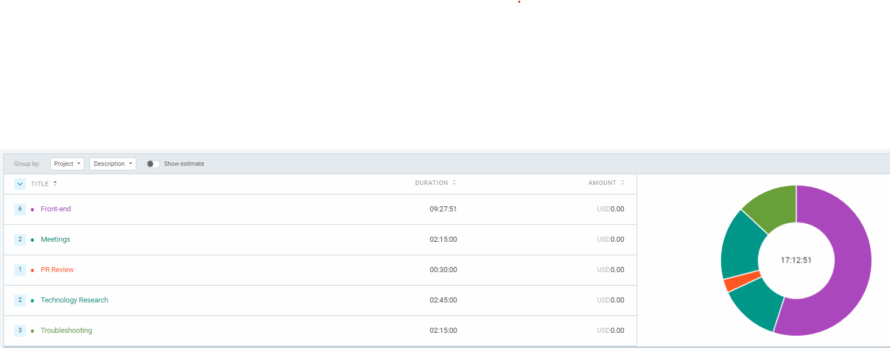
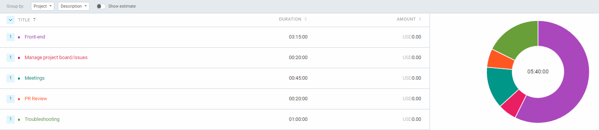
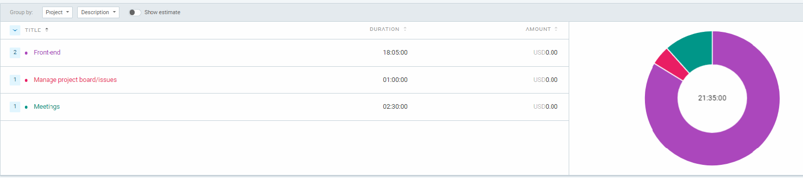

## Tuesday (6/28- 7/02)

### Timesheet
Clockify report

### Current Tasks (Provide sufficient detail and include t-shirt size)
  * #1: Finish the view exam page [S]
        -Create view exam page
        -Create view submissions page (added)
  * #2: Update navbar and dashboard [S]

### Progress Update (since 6/28/2024) 
<table>
    <tr>
        <td><strong>TASK/ISSUE #</strong>
        </td>
        <td><strong>STATUS</strong>
        </td>
    </tr>
    <tr>
        <!-- Task/Issue # -->
        <td>Create view exam page #169
        </td>
        <!-- Status -->
        <td>Completed
        </td>
    </tr>
    <tr>
        <!-- Task/Issue # -->
        <td>Update navbar and dashboard #244
        </td>
        <!-- Status -->
        <td>Completed
        </td>
    </tr>
</table>

### Cycle Goal Review (Reflection: what went well, what was done, what didn't; Retrospective: how is the process going and why?)
This cycle I finished the view submission and view exam pages (in the same PR). I
added more tables + filters to the view exam page. I also wrote a context and layout
for the submission information and moved the API calls to the backend. For the navbar
task I fixed bugs with the navigation and added a feature so that the navbar remains
highlighted when within subdirectories in course, exam, faq directory. Overall I completed everything I set out to do and the tasks are going well.
### Next Cycle Goals (What are you going to accomplish during the next cycle)
  * Finish the bubble sheet creation page
  
## Tuesday (6/26- 6/27)

### Timesheet
Clockify report

### Current Tasks (Provide sufficient detail and include t-shirt size)
  * #1: Finish the view exam page [S]
        -Create view exam page
        -Create view submissions page (added)
    #2: Optimize/refactor API calls within components [S]

### Progress Update (since 6/26/2024) 
<table>
    <tr>
        <td><strong>TASK/ISSUE #</strong>
        </td>
        <td><strong>STATUS</strong>
        </td>
    </tr>
    <tr>
        <!-- Task/Issue # -->
        <td>Create view exam page #169
        </td>
        <!-- Status -->
        <td>In Progress
        </td>
    </tr>
    <tr>
        <!-- Task/Issue # -->
        <td>Optimize/refactor API calls within components N/A
        </td>
        <!-- Status -->
        <td>In Progress
        </td>
    </tr>
</table>

### Cycle Goal Review (Reflection: what went well, what was done, what didn't; Retrospective: how is the process going and why?)
This cycle I completed both tables to retrieve exam submissions and exams. I wrote the 
frontend API endpoints for both of these tables. I also started refactoring some of the
API calls between pages using contexts and layouts. I had trouble figuring out some errors in react but received help with it. Overall, the process is going well and the
team is communicating well what requirements/tasks/blockers exist.
### Next Cycle Goals (What are you going to accomplish during the next cycle)
  * Complete the two pages I was working on once the endpoints are done. 
  * Finish refactoring the API calls with contexts

## Tuesday (6/21- 6/25)

### Timesheet
Clockify report

### Current Tasks (Provide sufficient detail and include t-shirt size)
  * #1: Create instructor view exam results page [S]
  * #2: Work on the table template [S]

### Progress Update (since 6/21/2024) 
<table>
    <tr>
        <td><strong>TASK/ISSUE #</strong>
        </td>
        <td><strong>STATUS</strong>
        </td>
    </tr>
    <tr>
        <!-- Task/Issue # -->
        <td>Create instructor view exam results page #169
        </td>
        <!-- Status -->
        <td>Complete
        </td>
    </tr>
    <tr>
        <!-- Task/Issue # -->
        <td>Work on the table template #102
        </td>
        <!-- Status -->
        <td>Completed
        </td>
    </tr>
</table>

### Cycle Goal Review (Reflection: what went well, what was done, what didn't; Retrospective: how is the process going and why?)
This cycle I completed all styling for the view exam results page and all the components on the page. I also wrote the frontend API
endpoint to get exams and connected it to the table. I spent a lot of time helping Ishika fix the abstract table component. Overall,
many both frontend and backend are making good progress but we may need to meet more in order to make sure everyone is on the same page.

### Next Cycle Goals (What are you going to accomplish during the next cycle)
  * Write the frontend API for retrieving exam submissions and create the table component to render it

## Tuesday (6/19- 6/20)

### Timesheet
Clockify report

### Current Tasks (Provide sufficient detail and include t-shirt size)
  * #1: Add more Issues to project board [XS]
  * #2: Instructor create exam page [S]

### Progress Update (since 6/19/2024) 
<table>
    <tr>
        <td><strong>TASK/ISSUE #</strong>
        </td>
        <td><strong>STATUS</strong>
        </td>
    </tr>
    <tr>
        <!-- Task/Issue # -->
        <td>Create Join course Page N/A
        </td>
        <!-- Status -->
        <td>Complete
        </td>
    </tr>
    <tr>
        <!-- Task/Issue # -->
        <td>Instructor create exam page #136
        </td>
        <!-- Status -->
        <td>Complete
        </td>
    </tr>
</table>

### Cycle Goal Review (Reflection: what went well, what was done, what didn't; Retrospective: how is the process going and why?)
I completed both tasks I set out to complete. Overall the process is going smoothly and I have no complaints about our project
velocity. I think one area we can improve on is having everyone on the team review PRs faster since we often have many
outstanding PRs.

### Next Cycle Goals (What are you going to accomplish during the next cycle)
  * Work on the view exam results page
  * Work on some of the frontend API endpoints
  * Work on the admin add semester page

## Tuesday (6/14- 6/18)

### Timesheet
Clockify report

### Current Tasks (Provide sufficient detail and include t-shirt size)
  * #1: Create Join course Page [S]
  *     - Create Join course frontend api
  *     - Create the join course modal
  * #2: Instructor create exam page [S]

### Progress Update (since 6/14/2024) 
<table>
    <tr>
        <td><strong>TASK/ISSUE #</strong>
        </td>
        <td><strong>STATUS</strong>
        </td>
    </tr>
    <tr>
        <!-- Task/Issue # -->
        <td>Create Join course Page #112
        </td>
        <!-- Status -->
        <td>Complete
        </td>
    </tr>
    <tr>
        <!-- Task/Issue # -->
        <td>Instructor create exam page #136
        </td>
        <!-- Status -->
        <td>In Progress
        </td>
    </tr>
</table>

### Cycle Goal Review (Reflection: what went well, what was done, what didn't; Retrospective: how is the process going and why?)
I completed task 1 almost finished task 2. Overall it is a bit unclear what tasks need to be worked on or are being worked on
because there aren't issues created for them yet. Today we had a meeting to clear up what everyone is working/plan to work on.
The issues can now be created.

### Next Cycle Goals (What are you going to accomplish during the next cycle)
  * Create more issues
  * Finish instructor create exam page

## Wednesday (6/12- 6/13)

### Timesheet
Clockify report

### Current Tasks (Provide sufficient detail and include t-shirt size)
  * #1: Finish Creating course endpoints in NestJS [S]

### Progress Update (since 6/12/2024) 
<table>
    <tr>
        <td><strong>TASK/ISSUE #</strong>
        </td>
        <td><strong>STATUS</strong>
        </td>
    </tr>
    <tr>
        <!-- Task/Issue # -->
        <td>Create course endpoints in NestJS #37
        </td>
        <!-- Status -->
        <td>Complete
        </td>
    </tr>
</table>

### Cycle Goal Review (Reflection: what went well, what was done, what didn't; Retrospective: how is the process going and why?)
I completed task #1. I also read up on flowbite and tailwind but it is not a task. Everything I am working on is going well.

The process is going smoothly, the team is using the project board effectively to assign work.

### Next Cycle Goals (What are you going to accomplish during the next cycle)
  * Work on frontend pages for letting a logged in student join a course 
  * Create more front end tasks as issues.

## Wednesday (6/7- 6/11)

### Timesheet
Clockify report

### Current Tasks (Provide sufficient detail and include t-shirt size)
  * #1: Setup database in TypeORM [S]
  * #2: Create course endpoints in NestJS [S]

### Progress Update (since 6/5/2024) 
<table>
    <tr>
        <td><strong>TASK/ISSUE #</strong>
        </td>
        <td><strong>STATUS</strong>
        </td>
    </tr>
    <tr>
        <!-- Task/Issue # -->
        <td> Setup database in TypeORM #36
        </td>
        <!-- Status -->
        <td>Complete
        </td>
    </tr>
    <tr>
        <!-- Task/Issue # -->
        <td>Create course endpoints in NestJS #37
        </td>
        <!-- Status -->
        <td>In Progress
        </td>
    </tr>
</table>

### Cycle Goal Review (Reflection: what went well, what was done, what didn't; Retrospective: how is the process going and why?)
I completed task #1 and almost finished task #2. Everything I am working on is going well.

Overall, the tasks I worked on took fairly long to complete even though they were not very technically demanding because of the large technology
learning curve. Since there are many technologies on our tech stack I haven't used before I expect the first 2 weeks of programming to take a lot
longer.

### Next Cycle Goals (What are you going to accomplish during the next cycle)
  * Finish Creating course endpoints in NestJS
  * Work on Mini-presentation
  * Read tailwind documentation
  * Read about NextJS middleware

