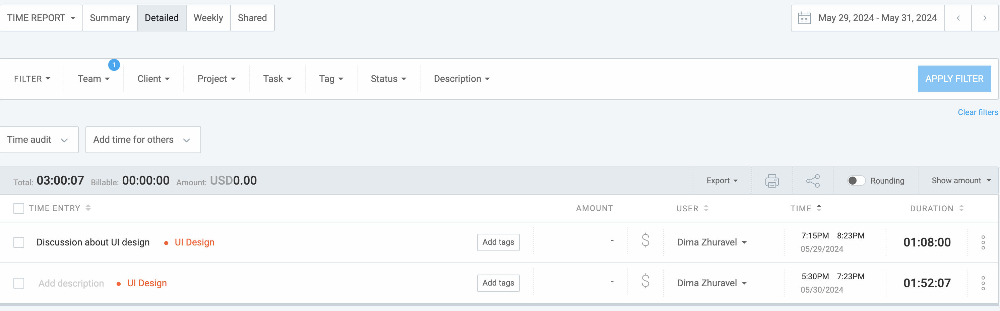
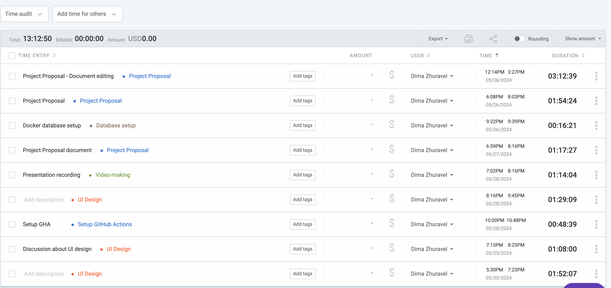

# May 29 - May 31

## Tasks worked on

Alternatively, use a screenshot of your clockify page (easier).

## Completed since last reporting date

## In Progress

- UI Design with Paula & Ishika
- Discussion of Database diagram w/ Fran
- System Architecture discussion w/ Fran
- Setting up GitHub Actions workflows

## This week's goals

1. Finish UI design
2. Finish System Architecture diagram
3. Finish Database diagram
4. Finish Design document with a team and record a video
5. Meet with client to discuss project plan
