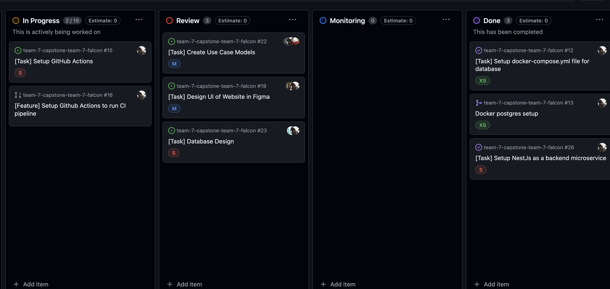

# May 31 - June 4

## Tasks worked on

["time"](time.png)

Alternatively, use a screenshot of your clockify page (easier).

## Completed since last reporting date

Items completed:
- Completed UI design
- Completed Database design
- Setup NestJS framework for backend
- Finished Design document with the team
- Discussed Project plan with client

## In Progress
- Setting up GitHub Actions workflows (was blocked by backend setup)
- Recording Project Design Document

## This week's goals
- Finish setting up GitHub Actions workflow
- Finish recording project design document
- Start work on implementing authentication system with Paula and Ishika
- Setup NestJs to run within docker environment
