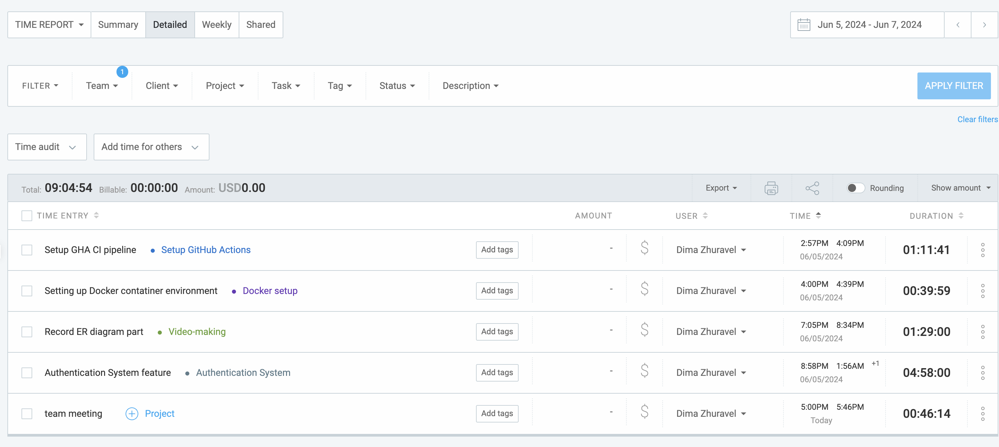
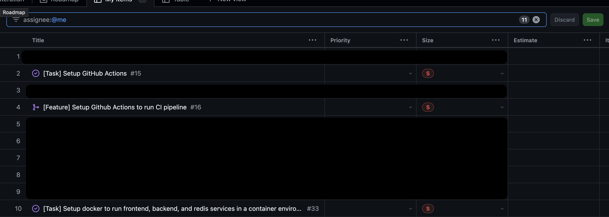

# June 5 - June 6

## Tasks worked on

## Completed since last reporting date

Items completed:
- [x] Finish setting up GitHub Actions workflow
- [x] Finish recording project design document
- [x] Setup NestJs to run within docker environment

## In Progress
- Work on implementing authentication system with Paula and Ishika. So far:
  - [x] Setup backend to connecto database
  - [x] Implemented three tables from ER design
  - [x] Test that require test database running locally are working

## This week's goals
- Setup Google OAuth credentials
- Add integration and unit tests for authentication endpoints
- Create README document to explain development process in backend
- Updated GitHub Actions to run database related integration and unit tests
- Finish authentication components in backend
