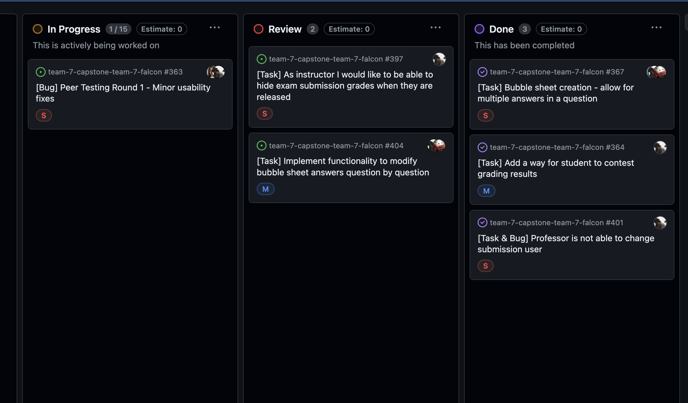

# Individual Logs

## Friday (7/31 - 8/01)

### Timesheet
Clockify report

### Current Tasks (Provide sufficient detail)
  * #1: Prepare for Test-O-Rama
  * #2: Setup production server

### Progress Update (since 7/31/2024)

<table>
    <tr>
        <td><strong>TASK/ISSUE #</strong>
        </td>
        <td><strong>STATUS</strong>
        </td>
    </tr>
    <tr>
        <!-- Task/Issue # -->
        <td>Issue #363
        </td>
        <!-- Status -->
        <td>Completed
        </td>
    </tr>
    <tr>
        <!-- Task/Issue # -->
        <td>Issue #417
        </td>
        <!-- Status -->
        <td>Completed
        </td>
    </tr>
    <tr>
        <!-- Task/Issue # -->
        <td>Issue #418
        </td>
        <!-- Status -->
        <td>Completed
        </td>
    </tr>
    <tr>
        <!-- Task/Issue # -->
        <td>Issue #409
        </td>
        <!-- Status -->
        <td>Completed
        </td>
    </tr>
    <tr>
        <!-- Task/Issue # -->
        <td>Issue #404
        </td>
        <!-- Status -->
        <td>Completed
        </td>
    </tr>
</table>

### Cycle Goal Review (Reflection: what went well, what was done, what didn't; Retrospective: how is the process going and why?)

During this cycle, I focused on fixing existing bugs reported by Paula or just testing the system by myself. I did find some critical bugs which could impact the system and OMR pipeline, but I was able to resolve them relative quickly. Overall, I am happy with the current state of the project, and hope that system will work fine once we hand over the project.

### Next Cycle Goals (What are you going to accomplish during the next cycle)
  * Finish individual report
  * Prepare for demo

## Wednesday (7/26 - 7/30)

### Timesheet
Clockify report

### Current Tasks (Provide sufficient detail)
  * #1: Prepare for Test-O-Rama by testing all features that we are planning to ask our users to test
  * #2: Merge all Pull Requests in review

### Progress Update (since 7/26/2024)

<table>
    <tr>
        <td><strong>TASK/ISSUE #</strong>
        </td>
        <td><strong>STATUS</strong>
        </td>
    </tr>
    <tr>
        <!-- Task/Issue # -->
        <td>Issue #367
        </td>
        <!-- Status -->
        <td>Completed
        </td>
    </tr>
    <tr>
        <!-- Task/Issue # -->
        <td>Issue #364
        </td>
        <!-- Status -->
        <td>Completed
        </td>
    </tr>
    <tr>
        <!-- Task/Issue # -->
        <td>Issue #401
        </td>
        <!-- Status -->
        <td>Completed
        </td>
    </tr>
    <tr>
        <!-- Task/Issue # -->
        <td>Issue #397
        </td>
        <!-- Status -->
        <td>In review
        </td>
    </tr>
    <tr>
        <!-- Task/Issue # -->
        <td>Issue #404
        </td>
        <!-- Status -->
        <td>In review
        </td>
    </tr>
    <tr>
        <!-- Task/Issue # -->
        <td>Issue #363
        </td>
        <!-- Status -->
        <td>Completed (pending changes by Ishika)
        </td>
    </tr>
</table>

### Cycle Goal Review (Reflection: what went well, what was done, what didn't; Retrospective: how is the process going and why?)

During this cycle, I was mainly focused on resolving the issue with submission missing Student reference in database as it was crashing frontend page for instructor. It's unfortunate that I didn't take into account this edge case, but I am happy that I have resolved it before project delivery. In addition, I have added additional columns for instructor's exam submission page to identify problematic submissions.

### Next Cycle Goals (What are you going to accomplish during the next cycle)
  * Prepare for Test-O-Rama and find any bugs that we haven't addressed

## Friday (7/24 - 7/25)

### Timesheet
Clockify report

### Current Tasks (Provide sufficient detail)
  * #1: Working on a feature that allows custom bubble sheet generator worker to create an exam with multiple answers in it.

### Progress Update (since 7/24/2024)

<table>
    <tr>
        <td><strong>TASK/ISSUE #</strong>
        </td>
        <td><strong>STATUS</strong>
        </td>
    </tr>
    <tr>
        <!-- Task/Issue # -->
        <td>Issue #369
        </td>
        <!-- Status -->
        <td>Completed
        </td>
    </tr>
    <tr>
        <!-- Task/Issue # -->
        <td>Issue #363
        </td>
        <!-- Status -->
        <td>Completed (Part of tasks that are assigned to me)
        </td>
    </tr>
    <tr>
        <!-- Task/Issue # -->
        <td>Issue #364
        </td>
        <!-- Status -->
        <td>In review
        </td>
    </tr>
    <tr>
        <!-- Task/Issue # -->
        <td>Issue #367
        </td>
        <!-- Status -->
        <td>In progress
        </td>
    </tr>
</table>

### Cycle Goal Review (Reflection: what went well, what was done, what didn't; Retrospective: how is the process going and why?)

During this cycle I was mainly focused on the feature that allows students to contest their grade submission. It ended up being a complicated feature as I was constantly circling back and forth between backend and frontend to make some changes based on the experience as professor and a student. Overall, I am happy with an outcome of this feature, but regret that it took me a while.

### Next Cycle Goals (What are you going to accomplish during the next cycle)
  * Finish feature that allows custom bubble sheet generator worker to create an exam with multiple answers in it.

## Wednesday (7/19 - 7/23)

### Timesheet
Clockify report

### Current Tasks (Provide sufficient detail)
  * #1: Working on a feature requested by Scott to allow students to dispute their submission grades in case if OMR did not grade them correctly. This involves new backend endpoints and frontend pages.

### Progress Update (since 7/19/2024)

<table>
    <tr>
        <td><strong>TASK/ISSUE #</strong>
        </td>
        <td><strong>STATUS</strong>
        </td>
    </tr>
    <tr>
        <!-- Task/Issue # -->
        <td>Issue #351
        </td>
        <!-- Status -->
        <td>Complete
        </td>
    </tr>
    <tr>
        <!-- Task/Issue # -->
        <td>Issue #369
        </td>
        <!-- Status -->
        <td>In review
        </td>
    </tr>
    <tr>
        <!-- Task/Issue # -->
        <td>Issue #363
        </td>
        <!-- Status -->
        <td>Completed (Part of tasks that are assigned to me)
        </td>
    </tr>
    <tr>
        <!-- Task/Issue # -->
        <td>Issue #364
        </td>
        <!-- Status -->
        <td>In progress
        </td>
    </tr>
</table>

### Cycle Goal Review (Reflection: what went well, what was done, what didn't; Retrospective: how is the process going and why?)

During this cycle I was addressing issues / suggestions provided by peers. A large amount of suggestions were resolved in one day. However, the larger feature such as allowing students to report an issue with their submission is taking a bit of time due to the amount of work that needs to be done. I think I made a solid progress during this cycle, but I was hopping to be almost done with this feature sooner.

### Next Cycle Goals (What are you going to accomplish during the next cycle)
  * Complete submission disputes feature
  * Work on a feature that allows custom bubble sheet generator worker to create an exam with multiple answers in it. This will required backend and python script changes. Bennett will focus on frontend while I am finishing the first feature

## Friday (7/17 - 7/18)

### Timesheet
Clockify report

### Current Tasks (Provide sufficient detail)
  * #1: Code review of other team members

### Progress Update (since 7/17/2024)

<table>
    <tr>
        <td><strong>TASK/ISSUE #</strong>
        </td>
        <td><strong>STATUS</strong>
        </td>
    </tr>
    <tr>
        <!-- Task/Issue # -->
        <td>Issue #325
        </td>
        <!-- Status -->
        <td>Complete
        </td>
    </tr>
</table>

### Cycle Goal Review (Reflection: what went well, what was done, what didn't; Retrospective: how is the process going and why?)

During this cycle, I was mostly working on endpoints to create mock data for Peer testing. I haven't created a task for it as I am still debating whether it's worth adding these endpoints to our backend. Other than that, I was trying to fix the issue on frontend (and most likely on backend) where user with missing student/employee id is not able to update their account details.

### Next Cycle Goals (What are you going to accomplish during the next cycle)
  * Address the issue with frontend and backend when user tries to authenticate to the system, but missing student or employee id
  * Add instructor page to view individual student's exam submission

## Wednesday (7/12 - 7/16)

### Timesheet
Clockify report

### Current Tasks (Provide sufficient detail)
  * #1: Preparing a seed data for Peer testing on Friday in backend
  * #2: Help other team members with frontend pages
  * #3: Reviewing PRs

### Progress Update (since 7/12/2024)

<table>
    <tr>
        <td><strong>TASK/ISSUE #</strong>
        </td>
        <td><strong>STATUS</strong>
        </td>
    </tr>
    <tr>
        <!-- Task/Issue # -->
        <td>Issue #311
        </td>
        <!-- Status -->
        <td>Complete
        </td>
    </tr>
    <tr>
        <!-- Task/Issue # -->
        <td>Issue #322
        </td>
        <!-- Status -->
        <td>Complete
        </td>
    </tr>
    <tr>
        <!-- Task/Issue # -->
        <td>Issue #323
        </td>
        <!-- Status -->
        <td>Complete
        </td>
    </tr>
    <tr>
        <!-- Task/Issue # -->
        <td>Issue #329
        </td>
        <!-- Status -->
        <td>Complete
        </td>
    </tr>
    <tr>
        <!-- Task/Issue # -->
        <td>Issue #331
        </td>
        <!-- Status -->
        <td>Complete
        </td>
    </tr>
    <tr>
        <!-- Task/Issue # -->
        <td>Issue #335
        </td>
        <!-- Status -->
        <td>Complete
        </td>
    </tr>
    <tr>
        <!-- Task/Issue # -->
        <td>Issue #339
        </td>
        <!-- Status -->
        <td>Complete
        </td>
    </tr>
    <tr>
        <!-- Task/Issue # -->
        <td>Issue #325
        </td>
        <!-- Status -->
        <td>In review
        </td>
    </tr>
</table>

### Cycle Goal Review (Reflection: what went well, what was done, what didn't; Retrospective: how is the process going and why?)

During this cycle I was able to complete all of the backend endpoints that we need based on the UI design. I have also implemented frontend pages for these backend endpoints. In addition, I have frontend page for admin pages such as showing all of the current courses in the system, and course editing. Overall, our team is doing great and we hope that we will finish all of the work on frontend and backend this week, so that we can focus on either helping with OMR processing or addressing feedback during the peer testing.

### Next Cycle Goals (What are you going to accomplish during the next cycle)
  * Prepare for Peer testing on Friday by creating a seed data in backend
  * Create test case scenarios for peer testing with a team
  * (If I have time) Work on exam view page to allow instructors to change the grade and update student id

## Friday (7/10 - 7/11)

### Timesheet
Clockify report

### Current Tasks (Provide sufficient detail)
  * #1: Backend endpoints for queue system for OMR processing script

### Progress Update (since 7/10/2024)

<table>
    <tr>
        <td><strong>TASK/ISSUE #</strong>
        </td>
        <td><strong>STATUS</strong>
        </td>
    </tr>
    <tr>
        <!-- Task/Issue # -->
        <td>Issue #239
        </td>
        <!-- Status -->
        <td>Complete
        </td>
    </tr>
    <tr>
        <!-- Task/Issue # -->
        <td>Issue #294
        </td>
        <!-- Status -->
        <td>Complete
        </td>
    </tr>
    <tr>
        <!-- Task/Issue # -->
        <td>Issue #311
        </td>
        <!-- Status -->
        <td>In review
        </td>
    </tr>
</table>

### Cycle Goal Review (Reflection: what went well, what was done, what didn't; Retrospective: how is the process going and why?)

For this cycle I promised to implement course analytics backend endpoint and start looking at implementing backend endpoints for OMR processing script. To summarize my progress, I have finished course analytics endpoint and it's being reviewed by the team. As for the OMR processing endpoints, I have a solid understanding of how it should be implemented; I strongly believe that I will be able to finish this work by the end of Wednesday. I hope that all remaining backend endpoints will be done by next Wednesday, which would allow me to dedicate time to help my team with the frontend work.

### Next Cycle Goals (What are you going to accomplish during the next cycle)
  * Finish backend endpoints for OMR processing script
  * Add backend endpoint to delete exam in the course and connect it to frontend
  * Add backend endpoint to download all submission grades for the exam in CSV file, and connect it to frontend
  * Connect exam release backend endpoint with frontend
  * Create a scheduled worker that archives courses when semester has ended

## Wednesday (7/5 - 7/9)

### Timesheet
Clockify report

### Current Tasks (Provide sufficient detail)
  * #1: Backend endpoints for queue system for OMR processing script
  * #2: Backend endpoint to retrieve all course exam and submission information for the course analytics page

### Progress Update (since 7/5/2024)

<table>
    <tr>
        <td><strong>TASK/ISSUE #</strong>
        </td>
        <td><strong>STATUS</strong>
        </td>
    </tr>
    <tr>
        <!-- Task/Issue # -->
        <td>Issue #237
        </td>
        <!-- Status -->
        <td>Complete
        </td>
    </tr>
    <tr>
        <!-- Task/Issue # -->
        <td>Issue #245
        </td>
        <!-- Status -->
        <td>Complete
        </td>
    </tr>
    <tr>
        <!-- Task/Issue # -->
        <td>Issue #263
        </td>
        <!-- Status -->
        <td>Complete
        </td>
    </tr>
    <tr>
        <!-- Task/Issue # -->
        <td>Issue #283
        </td>
        <!-- Status -->
        <td>Complete
        </td>
    </tr>
    <tr>
        <!-- Task/Issue # -->
        <td>Issue #287
        </td>
        <!-- Status -->
        <td>Complete
        </td>
    </tr>
    <tr>
        <!-- Task/Issue # -->
        <td>Issue #239
        </td>
        <!-- Status -->
        <td>In review (Blocked by Paula's PR)
        </td>
    </tr>
    <tr>
        <!-- Task/Issue # -->
        <td>Issue #294
        </td>
        <!-- Status -->
        <td>In review
        </td>
    </tr>
</table>

### Cycle Goal Review (Reflection: what went well, what was done, what didn't; Retrospective: how is the process going and why?)

For this cycle I promised to implement a lot of endpoints that should have wrapped up backend work. However, I overestimated my ability to achieve all of the goals, which means that I need to carry over the last endpoints into the next cycle. Despite that, I am happy that I was able to finish all work around custom bubble sheet endpoints on frontend and backend. Furthermore, I am also super happy about implementing all of the backend endpoints for the admin pages, which should unblock my team members on frontend work.

### Next Cycle Goals (What are you going to accomplish during the next cycle)
  * Complete backend endpoint to retrieve all information about exams and submission in the course
  * Start and make progress on implementing backend endpoints for OMR processing

## Friday (7/3 - 7/4)

### Timesheet
Clockify report

### Current Tasks (Provide sufficient detail)
  * #1: Prepare for MVP by setting up all services (backend, frontend, python scripts)

### Progress Update (since 7/3/2024)

<table>
    <tr>
        <td><strong>TASK/ISSUE #</strong>
        </td>
        <td><strong>STATUS</strong>
        </td>
    </tr>
    <tr>
        <!-- Task/Issue # -->
        <td>Issue #241
        </td>
        <!-- Status -->
        <td>Complete
        </td>
    </tr>
    <tr>
        <!-- Task/Issue # -->
        <td>Issue #247
        </td>
        <!-- Status -->
        <td>Complete
        </td>
    </tr>
    <tr>
        <!-- Task/Issue # -->
        <td>Issue #259
        </td>
        <!-- Status -->
        <td>Complete
        </td>
    </tr>
    <tr>
        <!-- Task/Issue # -->
        <td>Issue #262
        </td>
        <!-- Status -->
        <td>Complete
        </td>
    </tr>
    <tr>
        <!-- Task/Issue # -->
        <td>Issue #237
        </td>
        <!-- Status -->
        <td>In review
        </td>
    </tr>
    <tr>
        <!-- Task/Issue # -->
        <td>Issue #239
        </td>
        <!-- Status -->
        <td>In review (Blocked by Paula's PR)
        </td>
    </tr>
    <tr>
        <!-- Task/Issue # -->
        <td>Issue #245
        </td>
        <!-- Status -->
        <td>In review
        </td>
    </tr>
    <tr>
        <!-- Task/Issue # -->
        <td>Issue #263
        </td>
        <!-- Status -->
        <td>In review
        </td>
    </tr>
</table>

### Cycle Goal Review (Reflection: what went well, what was done, what didn't; Retrospective: how is the process going and why?)

During this cycle, I mainly merged PRs from the previous cycle. In addition, I worked on some late PRs that were needed to be done for the MVP so that we can demo it tomorrow. Overall, the cycle was not too bad as I have completed all tasks that I mentioned before and also had time to add extra features

### Next Cycle Goals (What are you going to accomplish during the next cycle)
  * Work on queue system implementation for OMR processing
  * Work on all endpoints related to the admin controls
  * Work on endpoint to delete student from the course
  * Work on endpoint to download bubble sheet exam and answer key version
  * Work on retrieving course data for analytics

## Wednesday (6/28 - 7/2)

### Timesheet
Clockify report

### Current Tasks (Provide sufficient detail)

I have completed all of the tasks that I mentioned in the previous report and have no outstanding work that will be moved to the next cycle (besides merging PRs). The outstanding Pull Requests that needs to be merged are:
  * #1: Allow users to view graded exams (PDF file)
  * #2: Enforce users to have employee or student id linked to their acccount (technically blocked by Paula's work). Once my other PRs are merged, I will also need to update integration tests
  * #3: Allow users to view exam submission grade
  * #4: Allow professors and TAs to change submission grade (TA role is not created in the system as we didn't promise it originally, but it will be easy to add it in future, I am just setting a ground work)
  * #5: Allow admins and professors to change course details

### Progress Update (since 6/28/2024)

<table>
    <tr>
        <td><strong>TASK/ISSUE #</strong>
        </td>
        <td><strong>STATUS</strong>
        </td>
    </tr>
    <tr>
        <!-- Task/Issue # -->
        <td>Issue #169
        </td>
        <!-- Status -->
        <td>Complete
        </td>
    </tr>
    <tr>
        <!-- Task/Issue # -->
        <td>Issue #226
        </td>
        <!-- Status -->
        <td>Complete
        </td>
    </tr>
    <tr>
        <!-- Task/Issue # -->
        <td>Issue #235
        </td>
        <!-- Status -->
        <td>Complete
        </td>
    </tr>
    <tr>
        <!-- Task/Issue # -->
        <td>Issue #237
        </td>
        <!-- Status -->
        <td>In review
        </td>
    </tr>
    <tr>
        <!-- Task/Issue # -->
        <td>Issue #239
        </td>
        <!-- Status -->
        <td>In review
        </td>
    </tr>
    <tr>
        <!-- Task/Issue # -->
        <td>Issue #241
        </td>
        <!-- Status -->
        <td>In review
        </td>
    </tr>
    <tr>
        <!-- Task/Issue # -->
        <td>Issue #245
        </td>
        <!-- Status -->
        <td>In review
        </td>
    </tr>
    <tr>
        <!-- Task/Issue # -->
        <td>Issue #247
        </td>
        <!-- Status -->
        <td>In review
        </td>
    </tr>
</table>

### Cycle Goal Review (Reflection: what went well, what was done, what didn't; Retrospective: how is the process going and why?)

The cycle was very productive for me. I have completed a lot of core endpoints that are related to the student and instructor views. Based on my rough estimates, the backend is 90% complete, and I expect that by the end of next week, it will be fully complete (if not earlier). There might be a bit of a challenge in the next two cycles to figure out some details about backend endpoints and data that they expect, so I will need to coordinate with the other team members to see what's needed for their work.

### Next Cycle Goals (What are you going to accomplish during the next cycle)
  * Work on MVP
  * Implement backend endpoint to release grades for the exam

## Friday (6/26 - 6/27)

### Timesheet
Clockify report

### Current Tasks (Provide sufficient detail)
  * #1: Implement backend endpoint to retrieve "Graded exams" for students

### Progress Update (since 6/26/2024)

<table>
    <tr>
        <td><strong>TASK/ISSUE #</strong>
        </td>
        <td><strong>STATUS</strong>
        </td>
    </tr>
    <tr>
        <!-- Task/Issue # -->
        <td>Issue #182
        </td>
        <!-- Status -->
        <td>Complete
        </td>
    </tr>
    <tr>
        <!-- Task/Issue # -->
        <td>Issue #223
        </td>
        <!-- Status -->
        <td>Complete
        </td>
    </tr>
    <tr>
        <!-- Task/Issue # -->
        <td>Issue #219
        </td>
        <!-- Status -->
        <td>Complete
        </td>
    </tr>
    <tr>
        <!-- Task/Issue # -->
        <td>Issue #169
        </td>
        <!-- Status -->
        <td>Complete (Backend portion)
        </td>
    </tr>
     <tr>
        <!-- Task/Issue # -->
        <td>Issue #226
        </td>
        <!-- Status -->
        <td>In progress
        </td>
    </tr>
</table>

### Cycle Goal Review (Reflection: what went well, what was done, what didn't; Retrospective: how is the process going and why?)

The cycle was a bit short, as usual. Hoewever, I was able to implement the backend endpoint to retrieve exam information requested by a team member. I was also able to implement the endpoint to retrieve upcoming exams. Unfortunately, my original assumption from the previous cycle was incorrect, and some of the endpoints require additional validation logic and queries to retrieve correct information. Thus, I was not able to achieve the goals that I planned for this cycle. However, after discussion with my team, we realised that at least one backend endpoint is not needed, therefore, it should reduce the amount of time I need to spend for the next cycle

### Next Cycle Goals (What are you going to accomplish during the next cycle)
  * Implement API endpoints to return PDF file and grade for the student view when they will look at their exams
  * Finish implementation of retrieving graded exams from courses for the user
  * Review Pull requests from other team members

## Wednesday (6/21 - 6/25)

### Timesheet
Clockify report

### Current Tasks (Provide sufficient detail)
  * #1: Implement backend endpoint to retrieve "Graded exams" for students (upcoming)
  * #2: Implement backend endpoint to retrieve "Exams Today" for students (upcoming)
  * #3: Implement backend endpoint to retrieve "Upcoming Exams" for student (upcoming)

### Progress Update (since 6/21/2024)

<table>
    <tr>
        <td><strong>TASK/ISSUE #</strong>
        </td>
        <td><strong>STATUS</strong>
        </td>
    </tr>
    <tr>
        <!-- Task/Issue # -->
        <td>Issue #205
        </td>
        <!-- Status -->
        <td>Complete
        </td>
    </tr>
    <tr>
        <!-- Task/Issue # -->
        <td>Issue #182
        </td>
        <!-- Status -->
        <td>In review
        </td>
    </tr>
    <tr>
        <!-- Task/Issue # -->
        <td>Issue #169
        </td>
        <!-- Status -->
        <td>In review (include both backend and frontend components, I have implemented backend)
        </td>
    </tr>
</table>

### Cycle Goal Review (Reflection: what went well, what was done, what didn't; Retrospective: how is the process going and why?)

Overall, I am happy with a progress I have made on implementing registration and authentication process for users that will not use Google OAuth. This took me about 2-3 days to implement as it required me to research SMTP service that will deliver emails to the users; and of course, make a logic compatible with any other mail delivery services. During this cycle, I was also able to implement important endpoints to retrieve all exams and individual submission for exam. This is an important milestone as we are very close on finishing work around backend API.

### Next Cycle Goals (What are you going to accomplish during the next cycle)
  * As mentioned in the current tasks section, I will create and pick tasks to implement backend endpoints for the users to view exams in the student dashboard. I expect that a lot of the code will be reusable, which, hopefully, will allow me to complete these tasks before Friday's cycle
  * I will possibly start looking at the API endpoints to return PDF file and grade for the student view when they will look at their exams

## Friday (6/19 - 6/20)

### Timesheet
Clockify report

### Current Tasks (Provide sufficient detail)
  * #1: Work on implmentation of sign in and create user account with email and password
  * #2: Review backend and frontend PRs
  NOTE: The first task will most likely be completed within couple of days of the next cycle. I will expand/add to my "current tasks" new work based on the new frontend components implemented by the team.

### Progress Update (since 6/19/2024)

<table>
    <tr>
        <td><strong>TASK/ISSUE #</strong>
        </td>
        <td><strong>STATUS</strong>
        </td>
    </tr>
    <tr>
        <!-- Task/Issue # -->
        <td>Issue #152
        </td>
        <!-- Status -->
        <td>Complete
        </td>
    </tr>
</table>

### Cycle Goal Review (Reflection: what went well, what was done, what didn't; Retrospective: how is the process going and why?)

As promised for this cycle, I fixed some bugs that we have found before the demo (both on backend and frontend) on Wednesday (I haven't created an issue for this as it took me less than an hour). I also implemented a backend point to create exams for the courses.

To conclude, since it was a very short cycle, I haven't done additional work besides my original "Cycle Goals" that I have promised. I have noticed that after implementing major components for backend API, I have started to spend less time on developing new endpoints/features as I can reuse a lot of components/interfaces from original implementation which is a good sign that our software follows DRY and KISS principles (this is primary reason why my clockify time is lower compared to the first two weeks since the project development started).

### Next Cycle Goals (What are you going to accomplish during the next cycle)
  * Implement user login, registration, password restore, and user email confirmation on backend
  * Look into what other endpoints can be implemented on backend based on the team's frontend page deliveries during the cycle. Most likely I will focus on shipping backend endpoints for exams and course pages.

## Wednesday (6/14 - 6/18)

### Timesheet
Clockify report

### Current Tasks (Provide sufficient detail)
  * #1: Merge PR that allows professors and TAs to see students in the course (after the team reviews it)
  * #2: Review other PRs from the team
  * #3: Prepare for the demo on Wednesday
  * #4: Prepare development branch PR to be merged to master on Friday

### Progress Update (since 6/14/2024)

<table>
    <tr>
        <td><strong>TASK/ISSUE #</strong>
        </td>
        <td><strong>STATUS</strong>
        </td>
    </tr>
    <tr>
        <!-- Task/Issue # -->
        <td>Issue #128
        </td>
        <!-- Status -->
        <td>Complete
        </td>
    </tr>
    <tr>
        <!-- Task/Issue # -->
        <td>Issue #142
        </td>
        <!-- Status -->
        <td>Complete
        </td>
    </tr>
    <tr>
        <!-- Task/Issue # -->
        <td>Issue #131
        </td>
        <!-- Status -->
        <td>Pending team review / Complete
        </td>
    </tr>
</table>

### Cycle Goal Review (Reflection: what went well, what was done, what didn't; Retrospective: how is the process going and why?)

Since the last cycle, I promised to finish implementation of queue controller (Done) for python scripts. However, the work on retrieving exams information got deprioritized to accomodate new UI pages other team members are working on. As a result of this change, I focused on implementing backend endpoint to retrieve users' list for the course using a pagination approach of data retrieval to reduce the load on database. I also investigated and implemented a python script (a close to be done skeleton) for custom bubble sheet generator. The left over part for this script is to connect it to our backend and make fields customizable based on the input from backend.

### Next Cycle Goals (What are you going to accomplish during the next cycle)
  * Implement backend endpoint to create exams in the course
  * Look into / investigate implementation of backend endpoints for creating user accounts with email and passwords (alternative to Sign in with Google). The full functionality should be implemented next Wednesday
  * Fix minor bugs with UI and backend, which were found during the team meeting on Tuesday

## Wednesday (6/12 - 6/13)

### Timesheet
Clockify report

### Current Tasks (Provide sufficient detail)
  * #1: Queue Controller implemetion: As per our system architecture diagram, we wanted to implement a middleware that would allow our workers (python scripts) to pick up jobs to create new bubble sheets and process exams. In the current cycle, I was able to impleement this middleware, but still working on covering all test cases.
  * #2: Reviewing PRs: Reviewing pull requests from other team members to ensure that all test cases are covered by our integration and unit tests.

### Progress Update (since 6/12/2024)

<table>
    <tr>
        <td><strong>TASK/ISSUE #</strong>
        </td>
        <td><strong>STATUS</strong>
        </td>
    </tr>
    <tr>
        <!-- Task/Issue # -->
        <td>Issue #92
        </td>
        <!-- Status -->
        <td>Complete (by the time the individual logs are merged)
        </td>
    </tr>
    <tr>
        <!-- Task/Issue # -->
        <td>Issue #93
        </td>
        <!-- Status -->
        <td>In progress
        </td>
    </tr>
</table>

### Cycle Goal Review (Reflection: what went well, what was done, what didn't; Retrospective: how is the process going and why?)

Since the last cycle, I was able to investigate and implement most of the endpoints that will be used by the queue controller system. It took me few hours to understand how the queue library (bull) works with redis and our backend framework. I expect to finish a full implementation in few hours once the new cycle starts.

### Next Cycle Goals (What are you going to accomplish during the next cycle)
  * Finish queue controller implementation in backend
  * Implement backend endpoints related to retrieving exam results for users (upcoming, graded, and today)
  * Work on student's UI to allow them to see their exams (upcoming, graded, and today)

## Wednesday (6/7- 6/11)

### Timesheet
Clockify report

### Current Tasks (Provide sufficient detail)
  * #1: Authentication system. I have finished backend work to sign in and create user accounts on backend, so now I just need to support Paula and Ishika to complete frontend work

### Progress Update (since 6/7/2024)

<table>
    <tr>
        <td><strong>TASK/ISSUE #</strong>
        </td>
        <td><strong>STATUS</strong>
        </td>
    </tr>
    <tr>
        <!-- Task/Issue # -->
        <td>Issue #59
        </td>
        <!-- Status -->
        <td>Complete
        </td>
    </tr>
    <tr>
        <!-- Task/Issue # -->
        <td>Issue #71
        </td>
        <!-- Status -->
        <td>Complete
        </td>
    </tr>
    <tr>
        <!-- Task/Issue # -->
        <td>Issue #35
        </td>
        <!-- Status -->
        <td>In progress
        </td>
    </tr>
    <tr>
        <!-- Task/Issue # -->
        <td>Issue #53
        </td>
        <!-- Status -->
        <td>Complete
        </td>
    </tr>
    <tr>
        <!-- Task/Issue # -->
        <td>Issue #50
        </td>
        <!-- Status -->
        <td>Complete
        </td>
    </tr>
    <tr>
        <!-- Task/Issue # -->
        <td>Issue #64
        </td>
        <!-- Status -->
        <td>Complete
        </td>
    </tr>
    <tr>
        <!-- Task/Issue # -->
        <td>Issue #75
        </td>
        <!-- Status -->
        <td>Complete
        </td>
    </tr>
    <tr>
        <!-- Task/Issue # -->
        <td>Issue #78
        </td>
        <!-- Status -->
        <td>Complete
        </td>
    </tr>
    <tr>
        <!-- Task/Issue # -->
        <td>Issue #82
        </td>
        <!-- Status -->
        <td>In progress
        </td>
    </tr>
</table>

### Cycle Goal Review (Reflection: what went well, what was done, what didn't; Retrospective: how is the process going and why?)

I have completed Google OAuth on backend pretty early in the cycle. This allowed me to have extra time to add new features including:
 - Editing user details (backend)
 - Creating semesters (backend)
 - Sidebar navigation (frontend)
 - Allowing users to join the course with an invite link (backend).

So far our team is on track completing Milestone goals before the deadline. It took us some time to familiarize us team members with a tech stack on expectations of code base and design.

### Next Cycle Goals (What are you going to accomplish during the next cycle)
  * Prepare for mini presentation on Friday
  * Review pull requests of other team members
  * Look into queue system service implementation on backend
