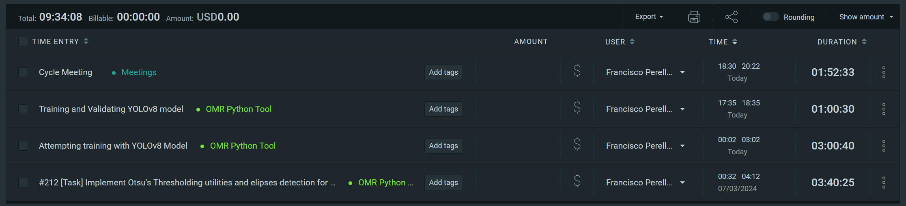
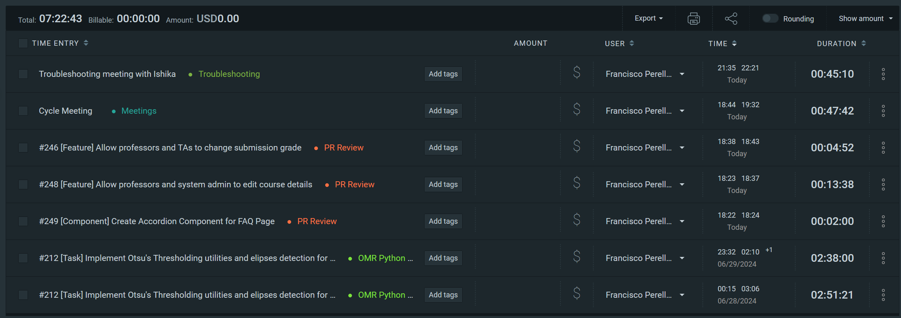
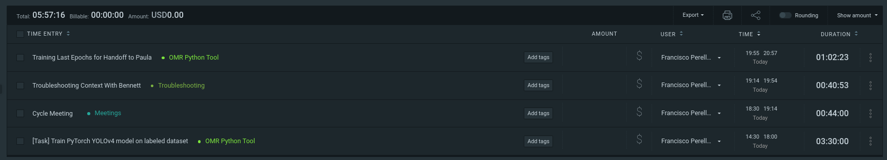

# Personal Logs

## Friday (7/10-7/11)

### Timesheet

Clockify report

### Current Tasks (Provide sufficient detail and include t-shirt size)

  1. Finish revisions for original OpenCV Utilities
  2. Create the new Utilities for inferenced data with OpenCV
  3. Integrate inferenced data into OMR Pipeline

### Progress Update (since 7/10/2024)

  1. Created tests for, optimized, and cleaned up the Inference class to be pushed to the development branch
  2. Prepared the other OpenCV Utilities to integrate with the inferenced data

### Cycle Goal Review (Reflection: what went well, what was done, what didn't; Retrospective: how is the process going and why?)

The ONNX Model is now fully implemented with tests and documentation done. The next steps are to finish all of the integration tasks, I am optimistic that the pipeline will be functional by the end of the cycle.

### Next Cycle Goals (What are you going to accomplish during the next cycle)

  1. Have inference fully integrated in the pipeline
  2. Test model reliability on the full pipeline 
  3. Begin work on grading schemas

---
---
---

## Wednesday (7/05-7/09)

### Timesheet

Clockify report

### Current Tasks (Provide sufficient detail and include t-shirt size)

  1. Finish writing tests for inference class and add better documentation for its functions
  2. Integrating inference class into OMR grading pipeline
  3. Validating our in-house bubble sheets on the inference model

### Progress Update (since 7/05/2024)

  1. Created an inference class that works on the CPU with ONNX with high reliability from limited testing
  2. Created postprocessing steps for generating OpenCV bounding boxes from the results of the objects.

### Cycle Goal Review (Reflection: what went well, what was done, what didn't; Retrospective: how is the process going and why?)

The ONNX Model now works within our inference class and the bounding boxes are clean and accurate from the tests I ran. I want to write a few more tests before pushing the changes but they look very promising. I'll then start integrating the inference tasks with the rest of our OMR pipeline.
I also need to test out our own generated sheets on the model so I now if I need to train the model some more to account for them.

### Next Cycle Goals (What are you going to accomplish during the next cycle)

  1. Have inference integrated with the rest of the pipeline.
  2. Ensure our own sheets work with the pipeline as well
  3. start grading logic tasks.

---
---
---

## Friday (7/03-7/04)

### Timesheet

Clockify report

### Current Tasks (Provide sufficient detail and include t-shirt size)

  1. Create inference utilities for the object recognition model
  2. Integrate object recognition into the overall OMR pipeline
  3. Create a short demo for MVP presentation

### Progress Update (since 7/03/2024)

  1. Got a model that actually works by training on YOLOv8
  2. tested and validated inference results
  3. Exported model for use with ONNX

### Cycle Goal Review (Reflection: what went well, what was done, what didn't; Retrospective: how is the process going and why?)

Using YOLOv8 solved every problem I had with training the model, I then exported it to ONNX so thatr we are not using the library itself in production. Inference worked in my testing in the submodule's notebook, I now need to integrate it into our app

### Next Cycle Goals (What are you going to accomplish during the next cycle)

  1. Have inference tasks done
  2. Finish inference implementation on OMR pipeline

---
---
---

## Wednesday (6/28-7/02)

### Timesheet

Clockify report

### Current Tasks (Provide sufficient detail and include t-shirt size)

  1. Try some fixes suggested by Paula for the OMR model training tasks
  2. Finish implementing and writing additional tests for the other OMR utilities

### Progress Update (since 6/28/2024)

  1. Had a few conversations with Paula regarding the issues with the YOLOv4 model
  2. Implemented thresholding and detection of bubbles on the sheet for marking

  The processing tasks should be ready for review by tonight

### Cycle Goal Review (Reflection: what went well, what was done, what didn't; Retrospective: how is the process going and why?)

This cycle was a little bit slower, I handed off the model training to Paula so she can troubleshoot it as a fresh pair of eyes, and she suggested a few potential solutions that we will be trying out this week. The OpenCV utilities are working well, they just need the object detection to tie them together. I am still spending time helping teammates when I can.

### Next Cycle Goals (What are you going to accomplish during the next cycle)

  1. Finish the PR for the other processing tasks
  2. Either fix the OMR model or go back to the drawing board. If no solution is attainable, We will be shifting approaches from YOLOv4 to a different model with better support and documentation for Roboflow datasets. (I am currently eyeing Microsoft's Florence-2 model on Huggingface)

---
---
---

## Friday (6/26-6/27)

### Timesheet
Clockify report

### Current Tasks (Provide sufficient detail and include t-shirt size)

  1. Handoff to Paula for model validation
  2. Working on Thresholding tasks and splitting masks

### Progress Update (since 6/26/2024)

  1. Trained 275 Epochs of the OMR model
  2. Prepared training submodule for handoff to Paula
  3. Troubleshooted Context issues with Bennett and Paula

  The tasks are all still marked as in Progress as I think they still need time

### Cycle Goal Review (Reflection: what went well, what was done, what didn't; Retrospective: how is the process going and why?)

Training 275 epochs still did not yield promising results, I want a fresh pair of eyes on the model training so I have asked Paula to take a look at things while I work on the rest of the necessary utilities. We did make good progress in using contexts to memoize fetched data so we aren't querying as often on the backend.

### Next Cycle Goals (What are you going to accomplish during the next cycle)

  1. Have the remaining utilities completed (Now on a separate branch so Paula can work unimpeded while she takes over the model validation)
  2. Have some sort of model training solution working in collaboration with Paula

---
---
---

## Wednesday (6/21-6/25)

### Timesheet
Clockify report

### Current Tasks (Provide sufficient detail and include t-shirt size)
  1. Training model with pytorch and YOLOv4
  2. Creating utilities for handling different object types from model

### Progress Update (since 6/22/2024)

  1. Finished all image labeling and augmentations, downloaded the dataset for training
  2. Trained 50 Epochs on Roboflow generated yolov4 weights. Need to change my approach as inference utilities on that fork are deprecated and unmaintained
  3. Have begun setup to retrain on a custom fork of pytorch-yolov4 that I have created as a submodule for training.

### Cycle Goal Review (Reflection: what went well, what was done, what didn't; Retrospective: how is the process going and why?)
I have been struggling quite a bit with getting YOLOv4 to run on pytorch and actually get useful results. I was able to train 50 Epochs but know I need quite a bit more (mAP standards suggest a minimum of 273) to actually get useful object inference. My goal is to have a functional, trained model by the end of this week. If that does not happen, I will need to revise my approach.

### Next Cycle Goals (What are you going to accomplish during the next cycle)
  1. Have a functional model with at least the minimum epochs trained for fine-tuning
  2. The rest of the slicing and thresholding utilities should be completed

---
---
---

## Friday (6/19-6/20)

### Timesheet
Clockify report

### Current Tasks (Provide sufficient detail and include t-shirt size)
  1. Labeling the training corpus for the OMR model
  2. Implementing openCV edge detection and masking to supplement the model training  

### Progress Update (since 6/19/2024)

  1. Finished creating a corpus for labeling and training
  2. Implemented a utility which handles PDFs and converts them into PIL Image Objects for saving or further processing
  3. Scaffolded a component solution with a teammate

### Cycle Goal Review (Reflection: what went well, what was done, what didn't; Retrospective: how is the process going and why?)
I was able to implement the conversion utility which also helped me prepare the corpus for labeling, Some small changes to the dockerfile were also necessary for the utility to work in the container but it went smoothly and tests all passed. The process is going well, image labeling is tedious.

### Next Cycle Goals (What are you going to accomplish during the next cycle)
  1. Have all of the images Labeled
  2. Have a model trained on the corpus
  3. Have bubble row slicing and masking implemented (if objects are properly detected by the model) 

---
---
---

## Wednesday (6/14-6/19)

### Timesheet
Clockify report

### Current Tasks (Provide sufficient detail and include t-shirt size)
  1. Creating a Training Corpus for the YOLO model
  2. Programming backend preprocessing for uploaded files to OMR (i.e. ensuring right file types and file handling)
  3. Implementing openCV edge detection and some masking to supplement the model training  

### Progress Update (since 6/14/2024) 

  1. Finished Instructor Dashboard
  2. Finished Front end course creation
  3. Added API endpoints for the front end

### Cycle Goal Review (Reflection: what went well, what was done, what didn't; Retrospective: how is the process going and why?)
I was able to complete my main front end goals, and was able to help teammates with issues they are having with frontend tasks.

### Next Cycle Goals (What are you going to accomplish during the next cycle)
  1. Have the file preprocessing done 
  2. Have the corpus examples completed for image labeling

---
---
---

## Friday (6/12- 6/13)

### Timesheet
Clockify report

### Current Tasks (Provide sufficient detail and include t-shirt size)
  * #1: Finishing Student and Instructor Dashboards and Components
  * #2: Mini Presentation
  * #3 Full backend integration with frontend

### Progress Update (since 6/13/2024) 

### Cycle Goal Review (Reflection: what went well, what was done, what didn't; Retrospective: how is the process going and why?)
I was not able to finish everything I wanted for the week, authorization issues on the backend and delays in some deliverables caused slow progress

### Next Cycle Goals (What are you going to accomplish during the next cycle)
  * OMR Model Start
  * Finish Backend Integration
  * Bubblesheet creation Start

---
---
---

## Wednesday (6/7- 6/12)

### Timesheet
Clockify report

### Current Tasks (Provide sufficient detail and include t-shirt size)
  * #1: Finishing Student and Instructor Dashboards and Components
  * #2: Mini Presentation
  * #3: Styling for Friday

### Progress Update (since 6/5/2024) 
<table>
    <tr>
        <td><strong>TASK/ISSUE #</strong>
        </td>
        <td><strong>STATUS</strong>
        </td>
    </tr>
    <tr>
        <!-- Task/Issue # -->
        <td>[Task] Create Student and Instructor Dashboard
        </td>
        <!-- Status -->
        <td>In Progress
        </td>
    </tr>
    <tr>
        <!-- Task/Issue # -->
        <td>[Task] Implement Instructor Course Creation Frontend
        </td>
        <!-- Status -->
        <td>In Review
        </td>
    </tr>
    <tr>
        <!-- Task/Issue # -->
        <td>Added Project Proposal
        </td>
        <!-- Status -->
        <td>Done
        </td>
    </tr>
     <tr>
        <!-- Task/Issue # -->
        <td>[Task] Create overall structure of front-end application
        </td>
        <!-- Status -->
        <td>Done
        </td>
    </tr>
 
</table>

### Cycle Goal Review (Reflection: what went well, what was done, what didn't; Retrospective: how is the process going and why?)
Tasks are being completed as planned, I am spending a large portion of my time helping others with troubleshooting in different tasks

### Next Cycle Goals (What are you going to accomplish during the next cycle)
  * OMR Model Start
  * Finish layouts for user routes
  * Bubblesheet creation Start

___
___
___

# June 4 - June 7

## Tasks worked on

## Completed since last reporting date

Items completed:
- Video recording
- front end structure planning

## In Progress
- front-end structure implementation

## This week's goals
- OMR solution exploratory implementation
- Complete front-end structure
- Next.js middleware once authentification is implmented

---
---
---

# May 31 - June 4

## Tasks worked on

Alternatively, use a screenshot of your clockify page (easier).

## Completed since last reporting date

Items completed:
- Discussed Project plan with client
- Completed System Architecture
- Completed database design
- Set up Python OMR module in codebase
- Set up Python bubble sheet module in codebase
- Gave feedback in UI design sessions
- Finished Design document with the team

## In Progress
- Recording project design video
- Setting up frontend boilerplate

## This week's goals
- Finish recording design video
- Finish evaluating other groups' videos
- Finish setting up the frontend scaffolding for when we split roles

---
---
---

# May 29 - May 31

## Tasks worked on

## Completed since last reporting date

## In Progress

- System architecture diagram
- Database design
- Assisting with UI design

## This week's goals

1. Finish the system architecture section with written justification for our decisions
2. Finalize the database design diagram to prepare for implementation
3. Meet with client for additional specifications
4. Finish the design document as a team and complete video submission
5. Set up the codebase foundations once a plan is in place
