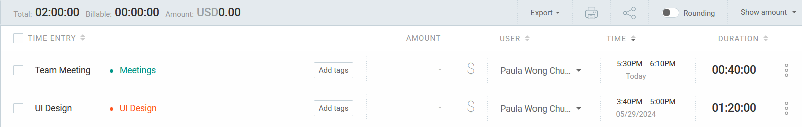
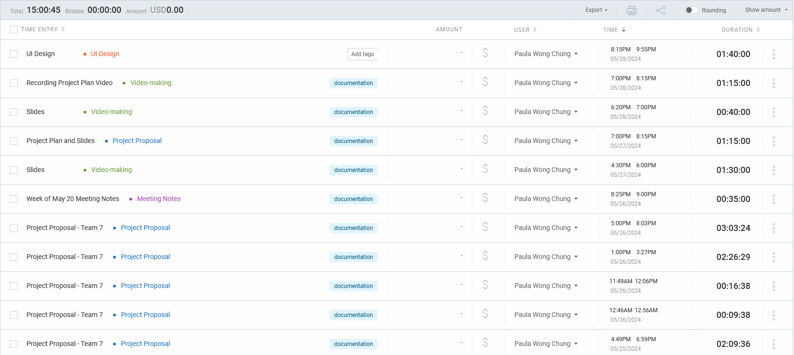

# May 29 - May 31

## Tasks worked on

## Completed since last reporting date

## In Progress

Design document:

- Use case models (with everyone).
- Data flow diagram with Bennett and Ishika.
- UI design with Dima and Ishika.

## This week's goals

This week, I focused on completing the project plan and the corresponding video with everyone.
For the next cycle, I will focus on completing the design document and its corresponding video.
