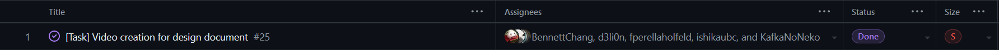

# June 5 - June 6

## Tasks worked on

## Completed since last reporting date

## In Progress

Will start working on implementing the authentication system with Dima and Ishika.

## This week's goals

This cycle, the focus was to complete the design video and to start planning on the next steps.
For the next cycle, the goal is to complete the authentication system and to start working on the OMR backend.
