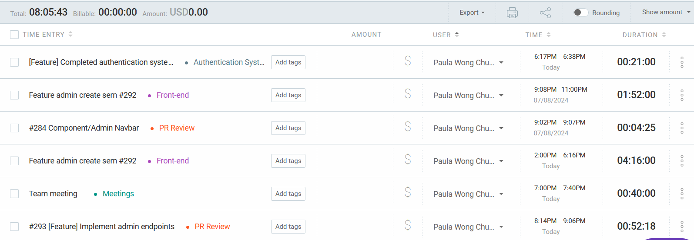

# Individual Logs for Paula

## Friday (7/10 - 7/11)

### Timesheet

Clockify report

### Current Tasks

* #1: Authentication pages (frontend and backend) - Code refactoring
* #2: Repo clean up and documentation updates
* #3: Admin create new semester page

### Progress Update (since 7/10/2024)

See the image in the previous section.

### Cycle Goal Review (Reflection: what went well, what was done, what didn't; Retrospective: how is the process going and why?)

This cycle, I have been able to slowly catch up on the backlog of tasks I have to complete. The create semester page is pretty much done - I just need to look into adding the pagination feature that all tables on the frontend lack at the moment. As for the authentication system, it needs quite a bit of refactoring before merging so that is to be done during the next cycle.

### Next Cycle Goals (What are you going to accomplish during the next cycle)

* Add pagination to admin create new semester page
* Address PR suggestions for the authentication system (refactoring)
* Probably work on another admin page
* (If time permits) Repo clean up and documentation updates

## Wednesday (7/05 - 7/09)

### Timesheet

Clockify report

### Current Tasks

* #1: Authentication pages (frontend and backend) - need to update frontend logic to enfore IDs
* #2: Repo clean up and documentation updates
* #3: Admin create new semester page

### Progress Update (since 7/05/2024)

See the image in the previous section.

### Cycle Goal Review (Reflection: what went well, what was done, what didn't; Retrospective: how is the process going and why?)

I was not able to complete all the tasks I set out to do this cycle due to some personal health issues but was able to build the create semester modal (with backend integration). I am hoping to complete these tasks in the next cycle.

### Next Cycle Goals (What are you going to accomplish during the next cycle)

* Repo clean up and documentation updates
* Admin create new semester page
* Address PR suggestions for the authentication system

## Friday (7/03 - 7/04)

### Timesheet

Clockify report

### Current Tasks

* #1: Authentication pages (frontend and backend) - need to update frontend logic to enfore IDs
* #2: Repo clean up and documentation updates
* #3: Admin create new semester page

### Progress Update (since 7/03/2024)

See the image in the previous section.

### Cycle Goal Review (Reflection: what went well, what was done, what didn't; Retrospective: how is the process going and why?)

This cycle, I finally completed the authentication system component and was able to do a few PR reviews. I also spent time prepping for tomorrow's MVP. Overall, I think the team is collaborating well and am satisfied with the current progress. We should probably merge PRs faster though.

### Next Cycle Goals (What are you going to accomplish during the next cycle)

* Repo clean up and documentation updates
* Admin create new semester page
* Take on any other frontend page if time permits

## Wednesday (6/28- 7/02)

### Timesheet

Clockify report

### Current Tasks

* #1: Authentication pages (frontend and backend)
* #2: Help Fran with the OMR validation if needed

Note: The Instructor bubble sheet creation page task which was previously assigned to me has been reassigned to
Bennett in the interest of time.

### Progress Update (since 6/28/2024)

See the image in the previous section.

### Cycle Goal Review (Reflection: what went well, what was done, what didn't; Retrospective: how is the process going and why?)

This cycle, I spent a significant amount of time debugging the authentication system component (Bennett was of great help again with debugging). I was not able to complete it as anticipated, but now have the core functionalities done. There might still be some minor bugs I have to fix. The next step is to complete the password reset functionality. This task was not as straightforward as I expected. In retrospective, I think I should have broken it down into smaller pieces.

### Next Cycle Goals (What are you going to accomplish during the next cycle)

* Test the authentication system for any bugs and implement the password reset functionality.
* PR Reviews.

## Friday (6/26- 6/27)

### Timesheet

Clockify report

### Current Tasks

* #1: Authentication pages (frontend and backend)
* #2: Chores such as fixing the page titles
* #3: Instructor bubble sheet creation page
* #4: OMR Model validation

### Progress Update (since 6/26/2024)

See the image in the previous section.

### Cycle Goal Review (Reflection: what went well, what was done, what didn't; Retrospective: how is the process going and why?)

This cycle, I started working on linking all of the authentication pages and integrating them with the backend. The obstacle I faced was the fact that some of the forms are multi-step forms and I was having trouble passing the data between the pages using contexts. Bennett and Fran suggested an alternative which Bennett had worked on, and I spent some time exploring that. I am still getting an error and will log off for the day, but will reach out to Bennett later so that I don't waste time trying to figure things out by myself.

### Next Cycle Goals (What are you going to accomplish during the next cycle)

* Complete the authentication component (link pages, integrate with backend) once the backend endpoints will all have been merged.
* Have a look at the OMR model validation while Fran works on other parts of the OMR system.

## Wednesday (6/21- 6/25)

### Timesheet

Clockify report

### Current Tasks

* #1: Authentication pages (frontend and backend)
* #2: Chores such as fixing the page titles
* #3: Instructor bubble sheet creation page

### Progress Update (since 6/21/2024)

See the image in the previous section.

### Cycle Goal Review (Reflection: what went well, what was done, what didn't; Retrospective: how is the process going and why?)

This cycle, I spent most of my time reviewing PRs as those were needed for my assigned tasks. It has gotten easier for me to understand the backend code so that is a plus point. I was not able to complete all the tasks I would have liked, but will do so in the next cycle. I will prioritise the authentication system.

### Next Cycle Goals (What are you going to accomplish during the next cycle)

* Complete the authentication component (link pages, integrate with backend) once the backend endpoints will all have been merged.

## Friday (6/19- 6/20)

### Timesheet

Clockify report

### Current Tasks

* #1: Authentication pages (frontend and backend)
* #2: Create student dashboard page
* #3: Chores such as fixing the page titles
* #4: Instructor bubble sheet creation page
* #5: Middleware Bug fix

### Progress Update (since 6/19/2024)

See the image in the previous section.

### Cycle Goal Review (Reflection: what went well, what was done, what didn't; Retrospective: how is the process going and why?)

This cycle, I completed the tasks I promised but also had to spend some time fixing the error that the middleware was throwing. Dima pointed out that the issue is that expired tokens were not being deleted. I pushed a fix, but need to test it further. I feel good about the project overall, but wish the size of the PRs were smaller. It already takes me longer to read the code since the language is unfamiliar to me, and the large size of the PRs do not help =(

### Next Cycle Goals (What are you going to accomplish during the next cycle)

* Brush up on typescript and react on the weekend
* Complete the authentication component (link pages, integrate with backend) once the backend endpoints will be available.
* Start working on the instructor bubble sheet creation page

## Wednesday (6/14- 6/18)

### Timesheet

Clockify report

### Current Tasks

* #1: Setup role-based authentication
* #2: Create account setup page ("you are almost there") - some updates were added to the design
* #3: Created the change/reset password pages
* #4: Working on the student dashboard

### Progress Update (since 6/14/2024)

See the image in the previous section.

### Cycle Goal Review (Reflection: what went well, what was done, what didn't; Retrospective: how is the process going and why?)

This cycle, I was able to complete the set up for role-based authentication (RBAC) as well as to create the UI for several pages. I think I am starting to better understand the code on both the frontend and backend, but am still unclear on several parts. I will need more time on the weekend to review TypeScript itself. Task #2 was complete, but we decided to add a new feature to improve user experience so that is to be completed in the next cycle. One issue I personally found (as Bennett also pointed out) was that it was unclear what we had to work on, but we discussed the tasks to be prioritised today and I now have a better idea of what to do.

### Next Cycle Goals (What are you going to accomplish during the next cycle)

* Finish authentication pages and student dashboard
* Work on more UI
* Help Fran make training data for the OMR model

## Friday (6/12- 6/13)

### Timesheet

Clockify report

### Current Tasks

* #1: Authentication system - link frontend and backend
* #2: Create account setup page ("you are almost there")
* #3: Work on user permissions using NextJS middleware with Fran.

### Progress Update (since 6/12/2024)

See the image in the previous section.

### Cycle Goal Review (Reflection: what went well, what was done, what didn't; Retrospective: how is the process going and why?)

While linking the frontend and backend of the authentication system only required one line of code (yes, this is embarrassing), it took me much longer to figure out the specifics (overthought it) and I ended up in a NestJS rabbit hole. I started work on task #2, and Dima will help me with fixing some of the bugs in the next cycle. Task #3 is being pushed to the next cycle as well.

### Next Cycle Goals (What are you going to accomplish during the next cycle)

* Work with Fran to set up user permissions for viewing pages.
* Complete the account setup page.
* Help more with the UI / work with Fran on the OMR backend (depending on what will be prioritised).

## Wednesday (6/7- 6/11)

### Timesheet

Clockify report

### Current Tasks

* #1: Authentication system - link frontend and backend
* #2: Work on user permissions using NextJS middleware with Fran.

### Progress Update (since 6/7/2024)

See the image in the previous section.

### Cycle Goal Review (Reflection: what went well, what was done, what didn't; Retrospective: how is the process going and why?)

Since I do not have previous experience using React, I was not able to contribute much this cycle. I spent more time going through the PRs and some documentation to try to understand the code. While I did go over the NextJS tutorial previously, I still found it hard to follow what the team has been doing so I ended up having to start looking into the basics of TypeScript (this is in progress).

Now that Ishika has finished the frontend and Dima the backend of the authentication system, I can start working on linking the two.

### Next Cycle Goals (What are you going to accomplish during the next cycle)

* Complete the authentication system that Dima and Ishika have worked on.
* Work with Fran to set up user permissions for viewing pages.
* Prep for the mini-presentation on Friday.
