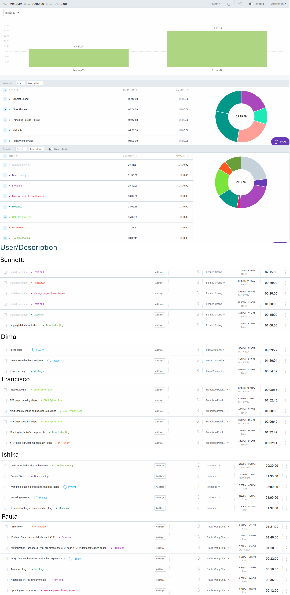

# Weekly Team Log for Team 7

---

## Date Range

- June 19 - June 20

## Features in the Project Plan Cycle

- Frontend
  - Authentication pages
  - Student dashboard
  - User table component
- Backend
  - Create exam API endpoint
- Connecting table components to backend
- Create exam form
- OMR
  - Training corpus creation
  - Utility which handles PDFs and converts them into PIL Image Objects for saving or further processing
- Joining course via invite link
- Bug fixes

## Associated Tasks from Project Board

## Tasks for Next Cycle

Issues which have not been created yet:

- Implement user login, registration, password restore, and user email confirmation on backend
- Backend endpoints for exams and course pages

## Burn-up Chart (Velocity)

NOTE: We noticed a bug in the chart generated by GitHub so these might not be very accurate. We had to generate the chart for June 19 - June 21 to get the correct number of completed items.

### This cycle

### Overall

## Times for Team/Individual

## Completed Tasks

## In Progress Tasks/ To do

## Test Report / Testing Status

Backend unit tests. Note that the red tests are files that are covered by integration tests that are not reported.

Backend integration tests.

Python tests for OMR system

## Overview

This cycle, the team focused on the frontend as well as reviewing PRs. There were several bugs and docker issues which slowed progress. These are hopefully fixed now. We are working towards finishing most of the UI for the instructor and student views, completing the authentication system, and to focus on creating a viable OMR model for the MVP.

---

## Date Range

- June 14 - June 18

## Features in the Project Plan Cycle

- Queue controller
- OMR
  - Bubble sheet generator python module
  - YOLO environment setup
  - Corpus creation
  - Image preprocessing
- Student dashboard
- Instructor dashboard (front end and backend integration)
- Authentication pages
- Reusable UI component: user table
- 'Create Exam' form
- Role-based access
- Joining course via invite link
- Custom bubble sheet creation
- Backend
  - Remove students from course
  - Retrieve students enrolled in course

## Associated Tasks from Project Board

## Tasks for Next Cycle

## Burn-up Chart (Velocity)

### This cycle

### Overall

## Times for Team/Individual

## Completed Tasks

## In Progress Tasks/ To do

## Test Report / Testing Status

Backend unit tests. Note that the red tests are files that are covered by integration tests that are not reported.

Backend integration tests.

Python tests for OMR system

## Overview

This cycle, the team focused on the frontend (and integration with the backend) since a lot of the backend features have been implemented. Role-based access is ready, and we have started to explore options for the OMR module. The next steps would be to finish most of the UI for the instructor and student views and to focus on creating a viable OMR model for the MVP.

---

## Date Range

- June 12 - June 13

## Features in the Project Plan Cycle

- Authentication using Google Auth
  - Linking frontend and backend
  - Account Setup page
- Instructor course creation
  - Frontend
- Instructor dashboard
- NestJS course endpoints
- Queueing system
- Creation of shared components across pages for UI

## Associated Tasks from Project Board

## Tasks for Next Cycle

## Burn-up Chart (Velocity)

### This cycle

### Overall

## Times for Team/Individual

## Completed Tasks

## In Progress Tasks/ To do

## Test Report / Testing Status

N/A

## Overview

The team focused on working towards completing the features required for Milestone #3, i.e. the ones required for the first round of mini-presentations. The authentication system using Google Auth has been completed. Various features such as the queuing system, instructor and student dashboards, and course creation are almost complete. The next cycle will focus on completing those features which are in progress and creating more pages for the UI. We will also start to look into the OMR system.

---

## Date Range

- June 7 - June 11

## Features in the Project Plan Cycle

- Authentication using Google Auth (frontend and backend)
  - Includes avatar setup
- Database setup
- Setup System roles
- Allow students to change their user details
- Allow students to join a course
- Allow admins to create semesters
- Allow for course creation
- Allow for the retrieval of a list of courses that a student is in
- Frontend
  - Navigation sidebar
  - Instructor dashboard and course creation modal form

## Associated Tasks from Project Board

## Tasks for Next Cycle

## Burn-up Chart (Velocity)

### This cycle

### Overall

## Times for Team/Individual

## Completed Tasks

## In Progress Tasks/ To do

## Test Report / Testing Status

N/A

## Overview

The team focused on working towards completing the features required for Milestone #3, i.e. the ones required for the first round of mini-presentations. The backend has been setup and work on the frontend has started. The next cycle will focus on completing the authentication system (we need to link the frontend to the backend) and the creation of UI elements and pages.
