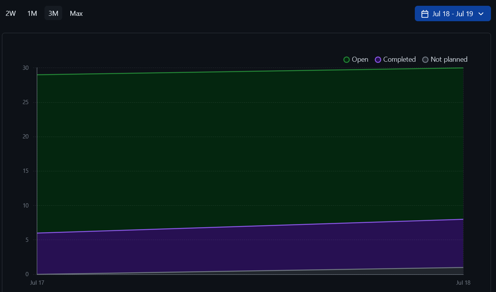
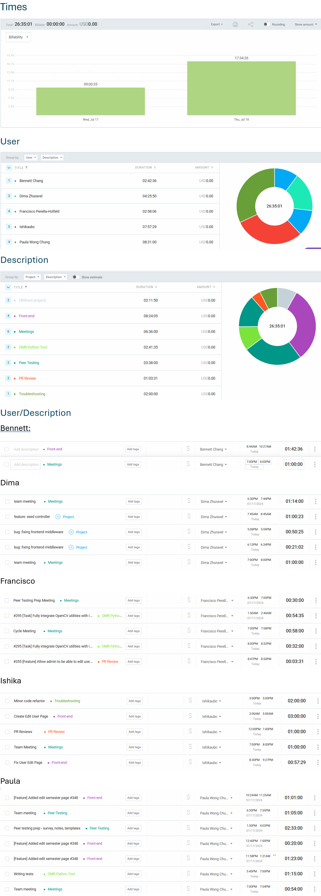
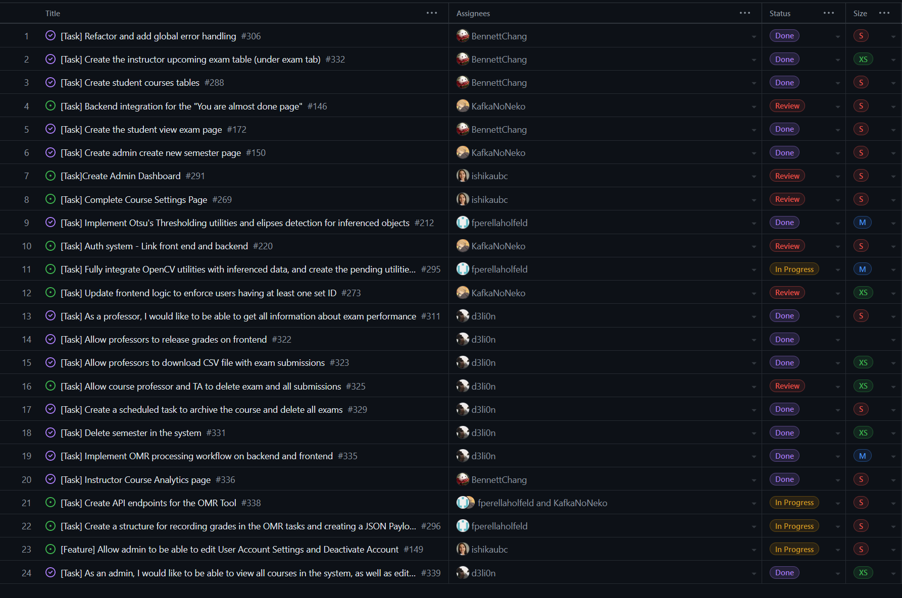
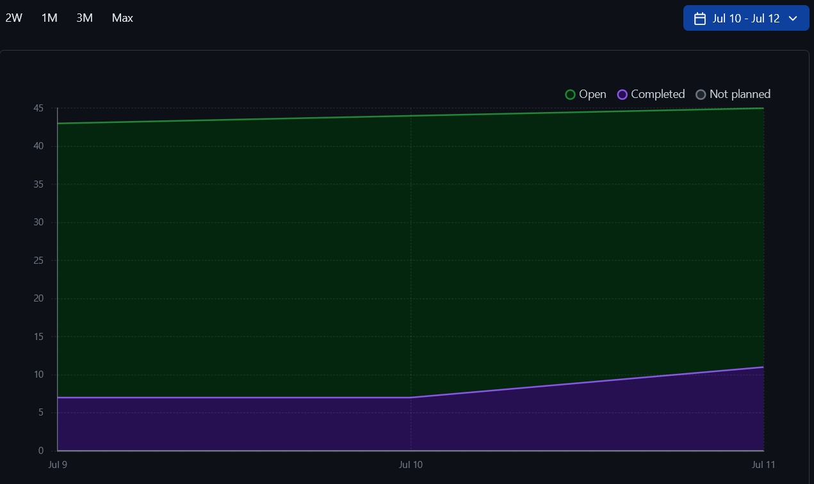

# Weekly Team Log for Team 7

## Date Range

- July 19 - July 23

## Features in the Project Plan Cycle

- Frontend
  - Admin users table
  - Course settings page
  - User account settings page
  - Authentication system
  - Instructor view submissions
  - Remove students from course
- Backend
  - Dispute submission grades
- OMR
  - Integrate OpenCV utilities into the pipeline
  - API endpoints
  - Structure for recording grades
  - Add identifiers to the pages
- Bug fixes
- Address usability issues from the first round of peer testing

## Associated Tasks from Project Board

## Tasks for Next Cycle

- Refactoring the student join course page

## Burn-up Chart (Velocity)

NOTE (1): We noticed a bug in the chart generated by GitHub so these might not be very accurate. We had to generate the chart for July 20 - July 24 to get the correct number of completed items. (The issues related to documentation have been filtered out this time.)

### This cycle

### Overall

## Times for Team/Individual

## Completed Tasks

## In Progress Tasks/ To do

- Refactoring the student join course page

## Test Report / Testing Status

Backend unit tests. Note that the red tests are files that are covered by integration tests that are not reported.

Backend integration tests.

Python tests for OMR system

## Overview

This cycle, the team worked on analysing the results (see `../../peer-testing-round-1`) from the peer testing exercise as well as addressing issues brought up during the exercise. Scott suggested additional features that will be great to have, and the team will be implementing 3 out of the 7:

| Feature | Decision |
| --- | --- |
| Adding identifiers to custom bubble sheet pages | In review |
| Contesting grading results | In progress |
| Allowing multiple correct answers for a single question | Will do |
| Varying number of bubbles per exam | This will require retraining of the model. Not possible given the timeline. |
| Changing point values for each question | Not planned. |
| Duplicating exams | Not planned |
| Having a separate answer key | Not planned |

Overall, the team is finishing up on the project and we hope to have most functionalities completed by Sunday so that we will have time for debugging and deployment.

---

## Date Range

- July 17 - July 18

## Features in the Project Plan Cycle

- Frontend
  - Admin edit semester
  - Admin dashboard
  - Course settings page
  - Auth system
- OMR
  - OMR pipeline integration
- Backend
  - Delete exam and all submissions
- Bug fixes
- Creation of seed data on backend
- Peer testing prep

## Associated Tasks from Project Board

## Tasks for Next Cycle

- adding the instructor submission page
- fixing any bugs reported during peer testing
- Address the issue with frontend and backend when user tries to authenticate to the system, but missing student or employee id
- Add instructor page to view individual student's exam submission

## Burn-up Chart (Velocity)

NOTE (1): We noticed a bug in the chart generated by GitHub so these might not be very accurate. We had to generate the chart for July 18 - July 19 to get the correct number of completed items. (The issues related to documentation have been filtered out this time.)

### This cycle

### Overall

## Times for Team/Individual

## Completed Tasks

## In Progress Tasks/ To do

- adding the instructor submission page
- fixing any bugs reported during peer testing
- Address the issue with frontend and backend when user tries to authenticate to the system, but missing student or employee id
- Add instructor page to view individual student's exam submission

## Test Report / Testing Status

Backend unit tests. Note that the red tests are files that are covered by integration tests that are not reported.

Backend integration tests.

Python tests for OMR system

## Overview

This cycle, the team mainly focused on preparing for tomorrow's peer testing. Some issues were brought up about insufficient testing of edge cases on the frontend. This is an area for improvement and the team will actively work on fixing this. Next cycle, we will focus on the OMR pipeline, the last few frontend pages, and addressing any bugs/issues reported during the peer testing exercise.

---

## Date Range

- July 12 - July 16

## Features in the Project Plan Cycle

- Authentication system (frontend and backend integration)
- Frontend
  - Refactoring and global error handling
  - Instructor upcoming exam table
  - Student courses tables
  - Student view exam page
  - Admin create semester page
  - Admin dashboard
  - Course settings
  - Instructor course analytics
  - Admin edit user account
- OMR
  - Otsu's thresholding utilities
  - Integrate OpenCV utilities with inferenced data
  - API endpoints
  - Create a structure for recording grades in the OMR tasks and creating a JSON Payload
- Backend
  - Analytics
  - Release grades
  - Download csv file with exam submissions
  - Delete exam and all submissions
  - Scheduled task to archive course and delete all exams
  - Delete semester
  - OMR processing workflow (+ frontend)
  - View and edit course

## Associated Tasks from Project Board

## Tasks for Next Cycle

- Creation of seed data on backend
- Peer testing prep

## Burn-up Chart (Velocity)

NOTE (1): We noticed a bug in the chart generated by GitHub so these might not be very accurate. We had to generate the chart for July 12 - July 16 to get the correct number of completed items. (The issues related to documentation have been filtered out this time.)

### This cycle

### Overall

## Times for Team/Individual

## Completed Tasks

## In Progress Tasks/ To do

## Test Report / Testing Status

Backend unit tests. Note that the red tests are files that are covered by integration tests that are not reported.

Backend integration tests.

Python tests for OMR system

## Overview

This cycle, the team completed all of the planned backend endpoints (minus one or two more endpoints to be added due to changes in design) and most of the frontend pages as well. The next step is to prepare for the peer testing exercise on Friday and to complete the frontend pages and OMR pipeline. Overall, the team has been collaborating well and we are on track for completing the promised features on time.

---

## Date Range

- July 10 - July 11

## Features in the Project Plan Cycle

- Authentication system (frontend and backend integration)
- Frontend Admin View
  - Frontend
    - Create new semester page
    - Dashboard
- Frontend
  - Student view exam page
  - Instructor bubble sheet creation page
  - Course settings page
  - Student course tables
  - Refactoring and global error handling
- OMR
  - Otsu's thresholding utilities
  - Inference utilities
  - Integrate OpenCV utilities with inferenced data
- Backend
  - Enforcing users to have at least one ID set in the database
  - Admin endpoints
  - Analytics

## Associated Tasks from Project Board

## Tasks for Next Cycle

- Admin settings page
- OMR - integration into pipeline and grading schemas
- Connect exam release backend endpoint with frontend
- Add instructor exam tables
- Add instructor analytics page with graphs
- Backend
  - endpoints for OMR processing script
  - delete exam in a course
  - download all submission grades for the exam in CSV file
  - Create a scheduled worker that archives courses when semester has ended

## Burn-up Chart (Velocity)

NOTE (1): We noticed a bug in the chart generated by GitHub so these might not be very accurate. We had to generate the chart for July 10 - July 11 to get the correct number of completed items. (The issues related to documentation have been filtered out this time.)

### This cycle

### Overall

## Times for Team/Individual

## Completed Tasks

## In Progress Tasks/ To do

## Test Report / Testing Status

Backend unit tests. Note that the red tests are files that are covered by integration tests that are not reported.

Backend integration tests.

Python tests for OMR system

## Overview

This cycle, the team continued to work towards completing the last few features of the system with a goal of finishing everything by next Friday. We have also started thinking of deploying the application.

---

## Date Range

- July 5 - July 9

## Features in the Project Plan Cycle

- Authentication system (frontend and backend integration)
- Admin View
  - Frontend
    - Create new semester page
    - Navigation bar
    - Dashboard
- Frontend course settings page
- Student course tables
- OMR
  - Model training
  - Otsu's thresholding utilities
  - Inference utilities
- Backend
  - Allowing users to retrieve graded exam submissions from the server
  - Enforcing users to have at least one ID set in the database
  - Allowing instructors to change grades
  - Allow instructors to release grades
  - Allow instructors to download custom bubble sheet exams
  - Allow instructors to delete all submissions of a removed user
  - Admin endpoints

## Associated Tasks from Project Board

## Tasks for Next Cycle

- Code Refactoring (Bennett)
- Backend
  - Complete backend endpoint to retrieve all information about exams and submission in the course
  - OMR processing

## Burn-up Chart (Velocity)

NOTE (1): We noticed a bug in the chart generated by GitHub so these might not be very accurate. We had to generate the chart for July 5 - July 10 to get the correct number of completed items. (The issues related to documentation have been filtered out this time.)

### This cycle

### Overall

## Times for Team/Individual

## Completed Tasks

## In Progress Tasks/ To do

## Test Report / Testing Status

Backend unit tests. Note that the red tests are files that are covered by integration tests that are not reported.

Backend integration tests.

Python tests for OMR system

## Overview

This cycle, the focus has been to complete the last pages required for the instructor and student views. Work on the admin view has started as well. The goal is to get all the core functionalities done by July 17th. Most of the backend endpoints are complete, and the last main components on the frontend which need to be worked on are the OMR integration and admin views. For the next cycle, we are also planning to refactor the code on the frontend.

---

## Date Range

- July 3 - July 4

## Features in the Project Plan Cycle

- Authentication system (frontend and backend integration)
- User Table component
- FAQ page
- OMR
  - Model training
  - Otsu's thresholding utilities
  - Inference utilities
- Backend
  - Allowing users to retrieve graded exam submissions from the server
  - Enforcing users to have at least one ID set in the database
  - Allowing users to view their grade for an exam
  - Allowing instructors to change grades
  - Allowing professors and admins to edit course details
  - Allowing instructors to retrieve submissions for an exam
  - Allowing for the retrieval of details for an exam
  - Retrieving upcoming exams for a user
  - Allowing users to see graded and upcoming exams for a course

## Associated Tasks from Project Board

## Tasks for Next Cycle

- #172 is assigned to Bennett
- Dima:
  - Work on queue system implementation for OMR processing
  - Work on all endpoints related to the admin controls
  - Work on endpoint to delete student from the course
  - Work on endpoint to download bubble sheet exam and answer key version
  - Work on retrieving course data for analytics

## Burn-up Chart (Velocity)

NOTE (1): We noticed a bug in the chart generated by GitHub so these might not be very accurate. We had to generate the chart for July 3 - July 4 to get the correct number of completed items. (The issues related to documentation have been filtered out this time.)

### This cycle

### Overall

## Times for Team/Individual

## Completed Tasks

## In Progress Tasks/ To do

## Test Report / Testing Status

Backend unit tests. Note that the red tests are files that are covered by integration tests that are not reported.

Backend integration tests.

Python tests for OMR system

## Overview

This cycle, the team focused on completing the features required for tomorrow's MVP. We also prepped our presentation. One thing which did not go well is PRs staying open for too long and hence leading to merge conflicts which took us more than an hour to resolve at the last minute. For the next cycle, we will start to work on the admin view as most of the core functionalities for the student and instructor views are complete. Progress on the OMR end is also going well.

---

## Date Range

- June 28 - July 2

## Features in the Project Plan Cycle

- Authentication system (frontend and backend integration)
- Create exam form
- User Table component
- FAQ page
- Instructor view exam results page
- OMR
  - Model training
  - Otsu's thresholding utilities
- Backend
  - Allowing users to retrieve graded exam submissions from the server
  - Enforcing users to have at least one ID set in the database
  - Allowing users to view their grade for an exam
  - Allowing instructors to change grades
  - Allowing professors and admins to edit course details
  - Allowing instructors to retrieve submissions for an exam
  - Allowing for the retrieval of details for an exam
  - Retrieving upcoming exams for a user
  - Allowing users to see graded and upcoming exams for a course
- Navigation bar bug fix

## Associated Tasks from Project Board

## Tasks for Next Cycle

- backend endpoint to release grades for the exam [Dima]
- course settings page [Ishika]

## Burn-up Chart (Velocity)

NOTE (1): We noticed a bug in the chart generated by GitHub so these might not be very accurate. We had to generate the chart for June 28 - July 02 to get the correct number of completed items. In addition, the issues for all of the logs required till the end of the term were opened in one go and so there are more open issues than completed ones.

NOTE(2): There was an issue with the burn up chart not reflecting our work. This was due to tasks being archived. We un-archived those to produce new ones.

### This cycle

### Overall

## Times for Team/Individual

## Completed Tasks

## In Progress Tasks/ To do

## Test Report / Testing Status

Backend unit tests. Note that the red tests are files that are covered by integration tests that are not reported.

Backend integration tests.

Python tests for OMR system

## Overview

For the last two weeks, we planned to complete several tasks as described below.

| Task | Status |
| ---- | ------ |
| Backend endpoints for creating exams | Completed |
| OMR Training data creation | Completed |
| Backend Email/password authentication | Completed |
| Course Dashboard | Completed |
| OMR: Preprocessing | Completed |
| OMR: Corpus creation | Completed |
| OMR: OpenCV scripts | In Review |
| UI: Creation of reusable table components | In Review |
| OMR: model training | In Progress |
| Finish all authentication pages | In Progress |
| Instructors and TAs are able to search for course members in their course by the first and last name | In Progress |
| UI: Customise bubble sheet page | To do |
| Grade released page | To do |

While the team was not able to complete everything that we promised since more urgent tasks came up during development, we were able to complete the following additional tasks:

- Backend
  - Retrieving all exams for a course
  - Allowing instructors to retrieve submissions for an exam
  - Allowing for the retrieval of details for an exam
  - Retrieving upcoming exams for a user
  - Allowing users to see graded and upcoming exams for a course
- Frontend
  - Accordion component for FAQ page
- Create Exam page (frontend and backend integration)
- View exam results
- Various bug fixes

In Review (backend):

- Allowing users to retrieve graded exam submissions from the server
- Enforcing users to have at least one ID set in the database
- Allowing users to view their grade for an exam
- Allowing instructors to change grades
- Allowing professors and admins to edit course details

Overall, the team is collaborating well despite the roadblocks. Our focus is still the MVP, but we are cautiously optimistic about delivering everything we promised due to the unexpected blockers and bugs which came up in the last two weeks. However, we will have at least 50% of features implemented by Friday.

---

## Date Range

- June 26 - June 27

## Features in the Project Plan Cycle

- Authentication system (frontend and backend integration)
- OMR
  - Model training
  - Otsu's thresholding utilities
- Create exam form
- View exam results page
- Reusable UI table component
- FAQ page
- Backend
  - View exams associated with a course
  - Retrieve information about an individual exam
  - Retrieve all graded exams

## Associated Tasks from Project Board

## Tasks for Next Cycle

## Burn-up Chart (Velocity)

NOTE: We noticed a bug in the chart generated by GitHub so these might not be very accurate. We had to generate the chart for June 26 - June 28 to get the correct number of completed items. In addition, the issues for all of the logs required till the end of the term were opened in one go and so there are more open issues than completed ones.

### This cycle

### Overall

## Times for Team/Individual

## Completed Tasks

## In Progress Tasks/ To do

## Test Report / Testing Status

Backend unit tests. Note that the red tests are files that are covered by integration tests that are not reported.

Backend integration tests.

Python tests for OMR system

## Overview

This cycle was short but the team still made some progress. We unfortunately encountered some setbacks on all fronts but are working together to solve them. The backend work is fortunately going well, so we are focusing on the frontend and the OMR system.

---

## Date Range

- June 21 - June 25

## Features in the Project Plan Cycle

- Authentication system (frontend and backend)
  - In particular, email+password authentication
- OMR
  - Model training
  - Otsu's thresholding utilities
- Student dashboard (frontend and backend)
- Instructor view exam results page
- Create exam form
- Reusable UI table component
- Backend: View exams associated with a course
- Bug fix

## Associated Tasks from Project Board

## Tasks for Next Cycle

Other tasks yet to be created:

- Create table instances using the reusable table component [S]
- Integrate frontend and backend for the authentication system [S]

## Burn-up Chart (Velocity)

NOTE: We noticed a bug in the chart generated by GitHub so these might not be very accurate. We had to generate the chart for June 21 - June 26 to get the correct number of completed items. In addition, the issues for all of the logs required till the end of the term were opened in one go and so there are more open issues than completed ones.

### This cycle

### Overall

## Times for Team/Individual

## Completed Tasks

## In Progress Tasks/ To do

## Test Report / Testing Status

Backend unit tests. Note that the red tests are files that are covered by integration tests that are not reported.

Backend integration tests.

Python tests for OMR system

## Overview

For the last two cycles, we planned to complete several tasks as described below.

| Task | Status |
| ---- | ------ |
| Backend endpoints for creating exams | Completed |
| OMR Training data creation | Completed |
| Email/password authentication | In Review |
| UI: Creation of reusable table components | In Review |
| Finish all authentication pages | In Progress |
| OMR model training | In Progress  |
| UI: Customise bubble sheet page | To do |
| Instructors and TAs are able to search for course members in their course by the first and last name | To do |
| Course Dashboard | |
| Grade released page | To do |

While we did not completed all of the tasks, the team completed some other features which took precedence on those listed. Most backend endpoints for the instructor role (except analytics) have been completed and the next step is to implement those for the student role. The admin role will be our last priority. While progress has been slower this cycle due to changing requirements (in terms of UI), some bugs, and some issues building the reusable table component (this was an opportunity for the team to reflect on what went wrong), the team is on track to completing the features required for the MVP.

---

## Date Range

- June 19 - June 20

## Features in the Project Plan Cycle

- Frontend
  - Authentication pages
  - Student dashboard
  - User table component
- Backend
  - Create exam API endpoint
- Connecting table components to backend
- Create exam form
- OMR
  - Training corpus creation
  - Utility which handles PDFs and converts them into PIL Image Objects for saving or further processing
- Joining course via invite link
- Bug fixes

## Associated Tasks from Project Board

## Tasks for Next Cycle

Issues which have not been created yet:

- Implement user login, registration, password restore, and user email confirmation on backend
- Backend endpoints for exams and course pages

## Burn-up Chart (Velocity)

NOTE: We noticed a bug in the chart generated by GitHub so these might not be very accurate. We had to generate the chart for June 19 - June 21 to get the correct number of completed items.

### This cycle

### Overall

## Times for Team/Individual

## Completed Tasks

## In Progress Tasks/ To do

## Test Report / Testing Status

Backend unit tests. Note that the red tests are files that are covered by integration tests that are not reported.

Backend integration tests.

Python tests for OMR system

## Overview

This cycle, the team focused on the frontend as well as reviewing PRs. There were several bugs and docker issues which slowed progress. These are hopefully fixed now. We are working towards finishing most of the UI for the instructor and student views, completing the authentication system, and to focus on creating a viable OMR model for the MVP.

---

## Date Range

- June 14 - June 18

## Features in the Project Plan Cycle

- Queue controller
- OMR
  - Bubble sheet generator python module
  - YOLO environment setup
  - Corpus creation
  - Image preprocessing
- Student dashboard
- Instructor dashboard (front end and backend integration)
- Authentication pages
- Reusable UI component: user table
- 'Create Exam' form
- Role-based access
- Joining course via invite link
- Custom bubble sheet creation
- Backend
  - Remove students from course
  - Retrieve students enrolled in course

## Associated Tasks from Project Board

## Tasks for Next Cycle

## Burn-up Chart (Velocity)

### This cycle

### Overall

## Times for Team/Individual

## Completed Tasks

## In Progress Tasks/ To do

## Test Report / Testing Status

Backend unit tests. Note that the red tests are files that are covered by integration tests that are not reported.

Backend integration tests.

Python tests for OMR system

## Overview

This cycle, the team focused on the frontend (and integration with the backend) since a lot of the backend features have been implemented. Role-based access is ready, and we have started to explore options for the OMR module. The next steps would be to finish most of the UI for the instructor and student views and to focus on creating a viable OMR model for the MVP.

---

## Date Range

- June 12 - June 13

## Features in the Project Plan Cycle

- Authentication using Google Auth
  - Linking frontend and backend
  - Account Setup page
- Instructor course creation
  - Frontend
- Instructor dashboard
- NestJS course endpoints
- Queueing system
- Creation of shared components across pages for UI

## Associated Tasks from Project Board

## Tasks for Next Cycle

## Burn-up Chart (Velocity)

### This cycle

### Overall

## Times for Team/Individual

## Completed Tasks

## In Progress Tasks/ To do

## Test Report / Testing Status

N/A

## Overview

The team focused on working towards completing the features required for Milestone #3, i.e. the ones required for the first round of mini-presentations. The authentication system using Google Auth has been completed. Various features such as the queuing system, instructor and student dashboards, and course creation are almost complete. The next cycle will focus on completing those features which are in progress and creating more pages for the UI. We will also start to look into the OMR system.

---

## Date Range

- June 7 - June 11

## Features in the Project Plan Cycle

- Authentication using Google Auth (frontend and backend)
  - Includes avatar setup
- Database setup
- Setup System roles
- Allow students to change their user details
- Allow students to join a course
- Allow admins to create semesters
- Allow for course creation
- Allow for the retrieval of a list of courses that a student is in
- Frontend
  - Navigation sidebar
  - Instructor dashboard and course creation modal form

## Associated Tasks from Project Board

## Tasks for Next Cycle

## Burn-up Chart (Velocity)

### This cycle

### Overall

## Times for Team/Individual

## Completed Tasks

## In Progress Tasks/ To do

## Test Report / Testing Status

N/A

## Overview

The team focused on working towards completing the features required for Milestone #3, i.e. the ones required for the first round of mini-presentations. The backend has been setup and work on the frontend has started. The next cycle will focus on completing the authentication system (we need to link the frontend to the backend) and the creation of UI elements and pages.
